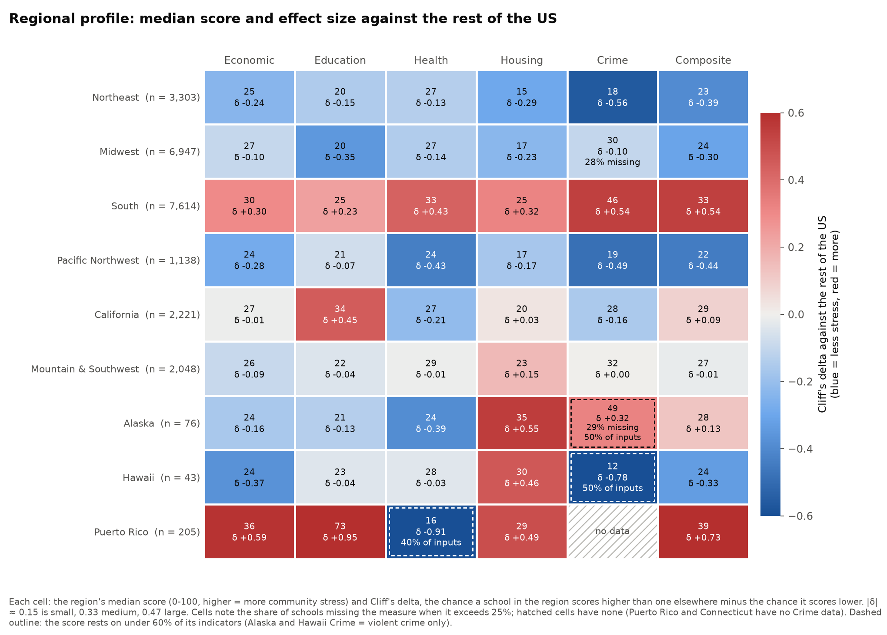
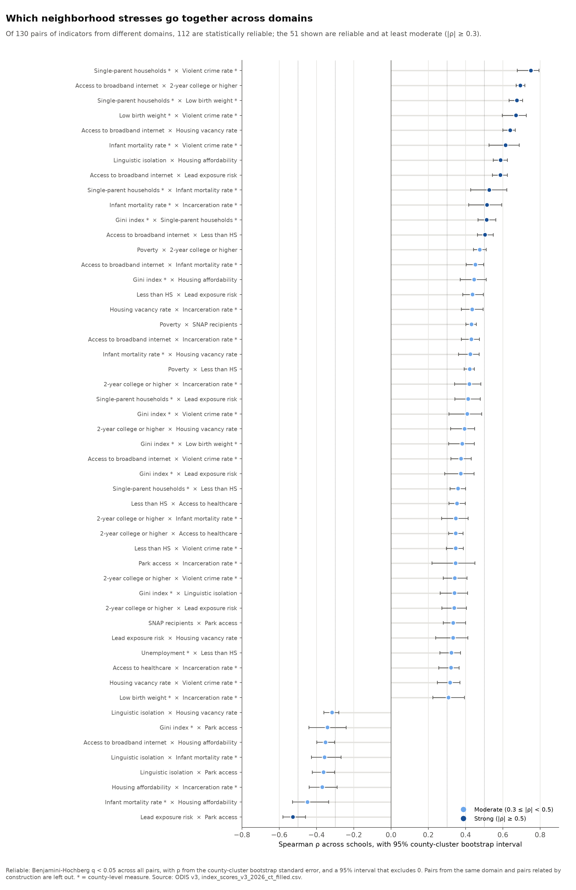
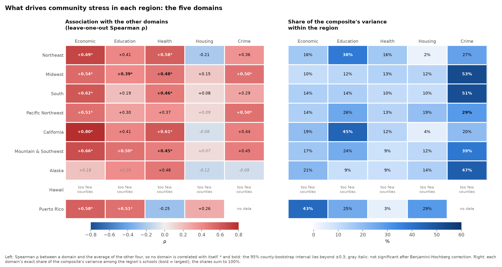
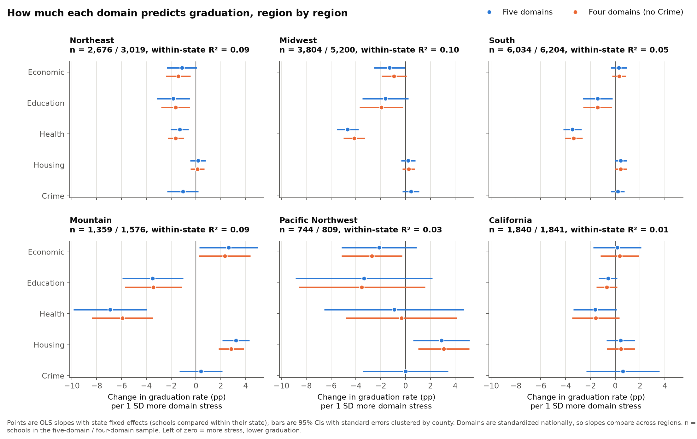
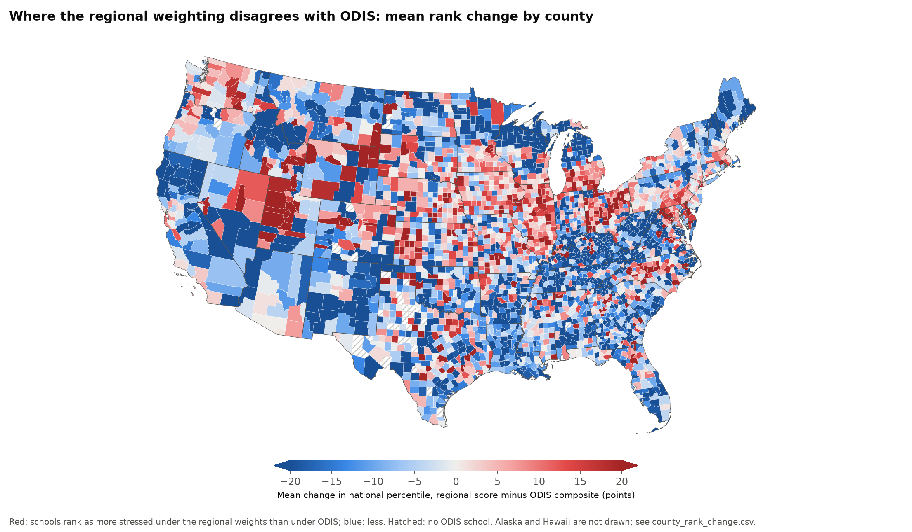

# The story in the data

Community stress around America's public high schools, for the Carolina Data Challenge 2026.
This is the three-minute version: what the Schoolscape map lets you see, what the data says nationally, how differently it plays out region by region, and what a policymaker could take from it.
Every number comes from the committed analyses in [visualizations/README.md](visualizations/README.md), cited by section (§01 to §05) and backed by the CSVs next to each chart.

"Stress" here means what the Open Data Index for Schools (ODIS) measures: adverse economic, education, health, housing, and crime conditions in the neighborhood around a school.
It does not describe the school, its students, or anyone's psychological stress.
Everything below is correlation across neighborhoods, not cause and effect.

## 1. The tool: what you can now see

[Schoolscape](site/) puts all 23,595 US public high schools in the ODIS data on one map (§01).
Each of the five ODIS domains, the composite, the Gini index, and 20 indicators is a layer, drawn by state, by county from zoom 5, and school by school from zoom 8.
Pick two layers and the insight panel computes their Spearman correlation live for whatever is on screen, with a 95% interval, at the level of areas and of the schools inside them.
Pin two states or counties to compare them side by side.

The map now tells this story itself.
The **Stories** list under the layers (or **Tell me the story** in the opening guide) walks through six narrated views in the order of this page, each with its key number and a caveat, and **Next** steps to the following one:

| # | Story | What the map shows |
| ---: | --- | --- |
| 1 | Where stress concentrates | Composite Score across the nation |
| 2 | Digital divide, education divide | Missing broadband × adults without a 2-year degree |
| 3 | Same pair, different regions | Education × Health, California compared with Florida |
| 4 | Housing runs backwards in the West | Housing affordability × Economic along the California coast |
| 5 | One formula does not fit everywhere | Composite × housing vacancy, Oneida County, Wisconsin |
| 6 | Where a lawmaker would look first | Health across the nation |

Any story opens directly from a link, for example `?p=where-stress-concentrates`.

## 2. What the data says nationally

1. **Stress concentrates in the South, but lives in counties.**
   The South's median Composite Score is 33 against 28 for all schools, and a Southern school outscores a school elsewhere about 77% of the time (Cliff's delta +0.54) (§03).
   Yet region explains only 28% of the composite's variance; 45% lies between counties of the same state (§03).
   The level that matters most for targeting is the county, not the region.
2. **Stress is not one thing.**
   Four separate dimensions explain 71% of the variation in the indicators, and the biggest explains only 29%: low attainment with weak connectivity, expensive immigrant neighborhoods, family and birth-health stress, and household poverty (§04).
3. **The digital divide tracks the education divide.**
   Missing broadband correlates ρ = 0.69 with adults lacking a 2-year degree across 23,404 schools, and it stays the strongest predictor of low adult attainment with 10 other conditions held fixed (+5.5 points per SD) (§04).
4. **Family structure, birth health, and violent crime move together**, ρ = 0.67 to 0.75 at the county level, the tightest cross-domain cluster in the data (§04).
5. **Housing stands apart.**
   The Housing domain correlates only 0.05 to 0.27 with the other four domains and 0.18 with the rest of the composite; within a county, schools with more housing stress have slightly less of the other kinds (§04).

## 3. It is different everywhere

The same pair of measures gives different answers in different regions: 8 of the 10 domain pairs have correlations that differ by region (p < 0.05, county-clustered) (§03).
Education and health stress go together at ρ = 0.65 in California and 0.59 in the Northeast, but only 0.29 in the South (p < 0.001) (§03).

To find what matters in each region without cheating, each domain is compared with the average of the *other* four (leave-one-out), and the composite's variance is split exactly into one share per domain (§03).

| Region (schools, composite median) | What to focus on | Where a lawmaker would look first |
| --- | --- | --- |
| **Northeast** (3,303, 23) | Economic stress carries the rest (ρ = +0.69); housing stress is slightly *lower* where other stress is high (ρ = −0.21) | Single-parent households (+0.57) and broadband (+0.55); education, the largest share of how communities differ (38%), concentrated in large-city schools |
| **Midwest** (6,947, 24) | County health and safety: infant mortality (+0.68) and violent crime (+0.60) track the rest most closely; crime is 53% of the composite's variance | Counties with high infant mortality and violent crime (both missing for 36-44% of Midwest schools, mostly rural) |
| **South** (7,614, 33) | Crime scores highest (median 46) and is 51% of the variance; economic stress travels with the rest (+0.62) | Family structure (+0.55) and broadband (+0.49); education stress is a separate problem here (+0.19) |
| **Pacific Northwest** (1,138, 22) | Economic stress and crime (+0.51, +0.50); housing affordability runs opposite (−0.51) | Housing cost as its own issue, which composite targeting would miss; broadband (+0.46) |
| **California** (2,221, 29) | Stress comes bundled: economic stress tracks everything (+0.80, the strongest of any region); education is 45% of the variance | Economic indicators as a single targeting signal; education stress from linguistic isolation and adults without a diploma; housing affordability runs opposite (−0.51) |
| **Mountain & Southwest** (2,048, 27) | Economic stress leads (+0.66); education is more tied to the rest than anywhere else (+0.50) | Broadband (+0.62) and single-parent households (+0.56); crime, 39% of the variance; New Mexico (35) against Utah (23) |

All figures in the table are from §03 ("Region by region"); ρ is the leave-one-out Spearman correlation with the rest of community stress.
Alaska (76 schools), Hawaii (43), and Puerto Rico (205) are too small for a driver ranking to be reliable; Alaska's housing stress is the highest of any region (median 35), and Puerto Rico's low Health score reflects missing data, not good health (§03).

### What the data says about our own hunches

We went in with three hypotheses, and the data corrected all three.

- **"In the Southeast, housing drives the composite."**
  Not supported.
  In the South, Housing is the domain least tied to the rest of community stress (ρ = +0.08) and the smallest share of the composite's variance (10%) (§03).
  Nationally, only 4% of the variance in housing stress lies between regions; it is a county-and-neighborhood matter (§03).
  The one housing signal in the South is vacancy (empty homes), moderately tied to other stress (ρ = +0.37) ([drivers_by_region.csv](visualizations/03-regional-variation/drivers_by_region.csv)).
- **"In California, food insecurity is the big one."**
  ODIS cannot test it.
  Its `SNAP recipients` column is the share of SNAP households that have children, not the share of households on SNAP, so it describes who receives SNAP, not how many (§03).
  What California's data does show is that economic stress is almost the whole story (ρ = +0.80), with broadband (+0.70), unemployment (+0.63), and poverty (+0.60) all strong (§03).
- **"Losing a home is worse in cold New York than in warm Miami."**
  ODIS does not measure homelessness: its Housing domain is vacancy, affordability, and park access (§05).
  Against graduation rates, more Housing stress goes with lower graduation in no region, and with *higher* graduation in the Mountain & Southwest (+3.2 points per SD) (§05).
  The broader idea behind the hunch, that one formula should not weigh stress the same everywhere, does hold up (next section).

### One formula does not fit everywhere

The ODIS composite averages the five domains with equal weights everywhere.
Section 05 asks how much each domain predicts the federal four-year graduation rate, region by region, comparing schools only within their own state.

- **The regions really differ** (joint Wald χ² = 172 on 25 df, p < 0.0001), driven by Health, Housing, and Economic stress (§05).
- **Health is the domain that tracks graduation.**
  One SD more Health stress goes with 4.7 points lower graduation in the Midwest, 3.4 in the South, and 7.4 in the Mountain & Southwest, against 1.3 in the Northeast: 3.6 times as much in the Midwest (95% CI 2.2 to 8.5) (§05).
- **The composite's biggest driver predicts graduation least.**
  Crime accounts for 45% of the variation in the composite, because its scores are the most spread out, but it is not significantly linked to graduation in any region once the other domains are held fixed (§05).
- **Weighting by region reshuffles half the schools.**
  With each region's graduation-based weights, 52% of schools move 10 or more national percentile points (Spearman ρ = 0.79 with the composite) (§05).
  Oneida County, Wisconsin, where vacation homes max out the vacancy indicator, falls from the 92nd percentile to the 14th; Utah County, Utah, and Ramsey County, Minnesota, rise by 36 and 34 points (§05).

## 4. So what: takeaways for policymakers

These are where the numbers point, not proof of what policy would work.

1. **Do not target with one national ranking.**
   The composite's ordering depends on how its domains are weighted, and a graduation-based weighting moves 52% of schools by 10 or more percentiles (§05).
   Rank within a region, and check which domain drives a school's score before acting on it.
2. **If graduation is the goal, look at Health first** in the Midwest, South, and Mountain & Southwest, where it goes with 3.4 to 7.4 points lower graduation per SD (§05).
   In the Northeast, the weight spreads across Health (35%), Economic (31%), and Education (24%) (§05).
3. **Broadband is the one signal that shows up everywhere.**
   It is the strongest predictor of low adult attainment nationally (§04), and it tracks the rest of community stress in every mainland region, from +0.34 in the Midwest to +0.70 in California ([drivers_by_region.csv](visualizations/03-regional-variation/drivers_by_region.csv), §03).
4. **In the West, treat housing cost as its own problem.**
   Unaffordable housing sits in otherwise less stressed places (ρ = −0.51 in California and the Pacific Northwest), so a composite-based program would pass it by (§03).
5. **Read a high crime score with care.**
   Crime dominates the composite's spread but not graduation (§05), it is one value per county (§03), and it is missing for 13.6% of schools, including all of Connecticut (§01, §03).

Community conditions explain only a small part of graduation differences within a state (within-state R² of 0.10 at most) (§05), so these are signals for where to look, not predictions for any one school.

## 5. How we know

- **A meaningful p for Spearman.**
  At n = 23,595, any |ρ| above 0.013 has p < 0.05, so p alone means little (§04).
  A pair counts only if it clears two bars: statistically reliable (Benjamini-Hochberg q < 0.05 with p from a county-cluster bootstrap, and a 95% cluster interval excluding 0) and practically meaningful (|ρ| of at least 0.3, moderate) (§04).
  321 of 351 pairs are reliable, and every pair with |ρ| ≥ 0.1 is, so the effect size (0.1 weak, 0.3 moderate, 0.5 strong), not the p-value, is what separates findings from noise (§04).
  51 of the 130 cross-domain indicator pairs clear both bars (§04).
  The smallest detectable |ρ| is 0.018 with every school and 0.050 with about 3,100 counties (§04).
- **County clustering.**
  Eight measures, including the whole Crime domain, are one value per county, and clustered intervals run about four times as wide as naive ones (§04).
  Every interval resamples whole counties; California's 2,221 schools in 58 large counties carry the information of about 17 independent observations (§03).
- **The circularity guard.**
  The composite is built from the domains, so a domain correlates with it partly by construction (Crime: 0.82 with the composite, 0.49 with the other domains' average) (§04).
  Regional drivers use leave-one-out correlations and exact variance shares instead (§03).
- **Data fixes.**
  19,154 school IDs stored in rounded form were recovered from the NCES directory (§01).
  Connecticut's missing values were filled from current Census, County Health Rankings, and state health data: 3,536 cells, taking it from the most incomplete state (21.0 missing cells per row) to 4.0 (§02).
  Graduation rates joined for 79.5% of schools with a usable rate; small and alternative schools drop out, but their communities are about as stressed (composite 28.5 against 28.3) (§05).
- **Missing data by region.**
  Crime is missing for 28% of Midwest schools and all of Connecticut, and Puerto Rico has no Crime score and only 2 of its 5 Health indicators, so their composites are not fully comparable (§03).
- **Caveats that apply throughout.**
  ODIS measures the community around a school, not its students; regions are a judgment call; graduation is one outcome, and weights learned from it say nothing about health or safety (§03, §05).
