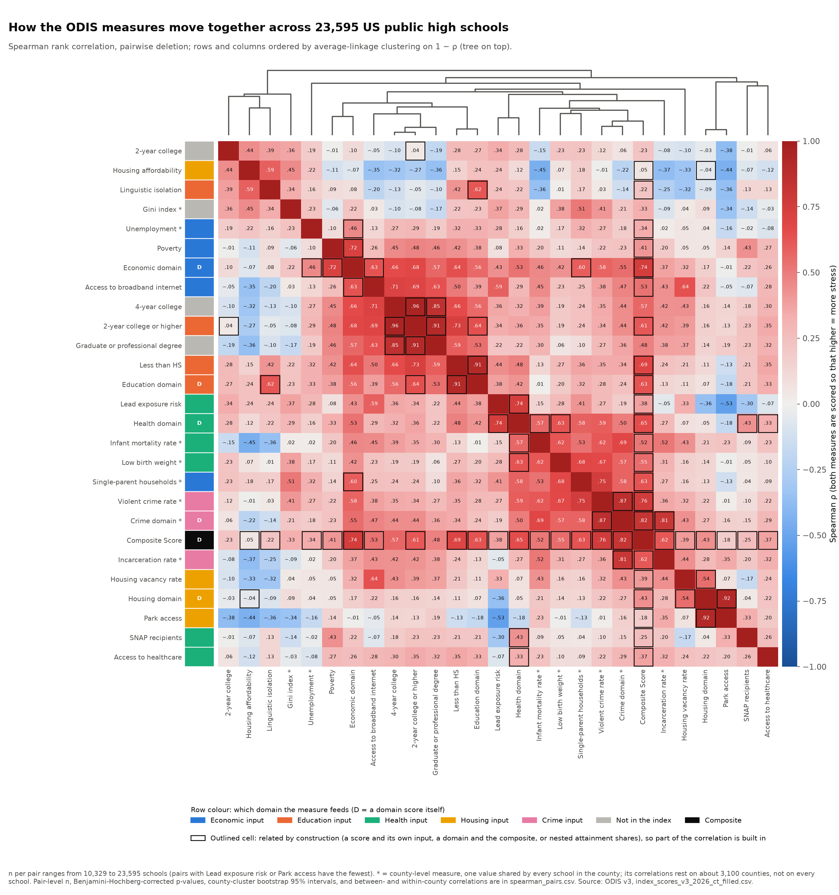
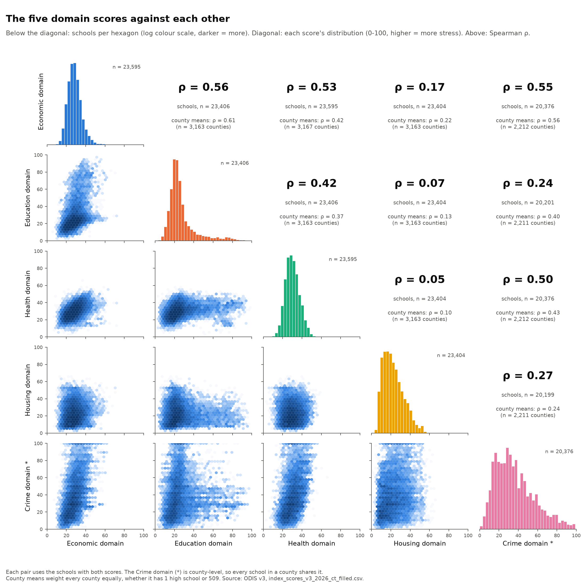
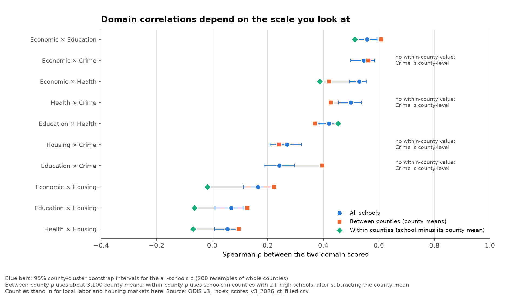
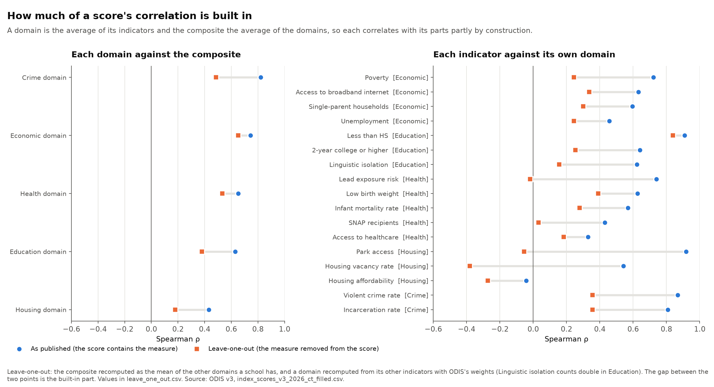
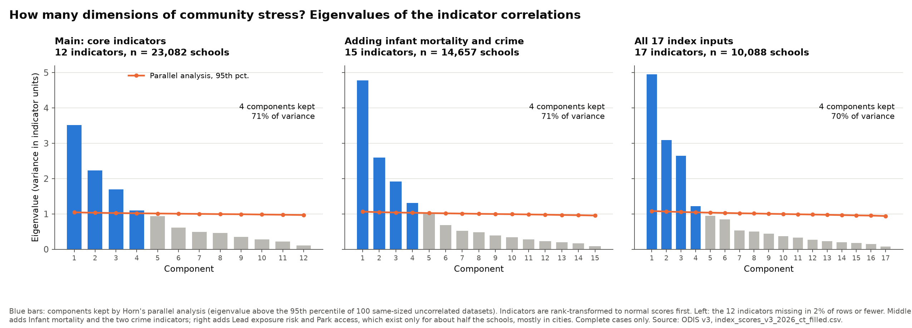
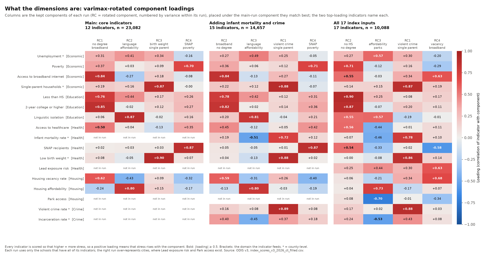
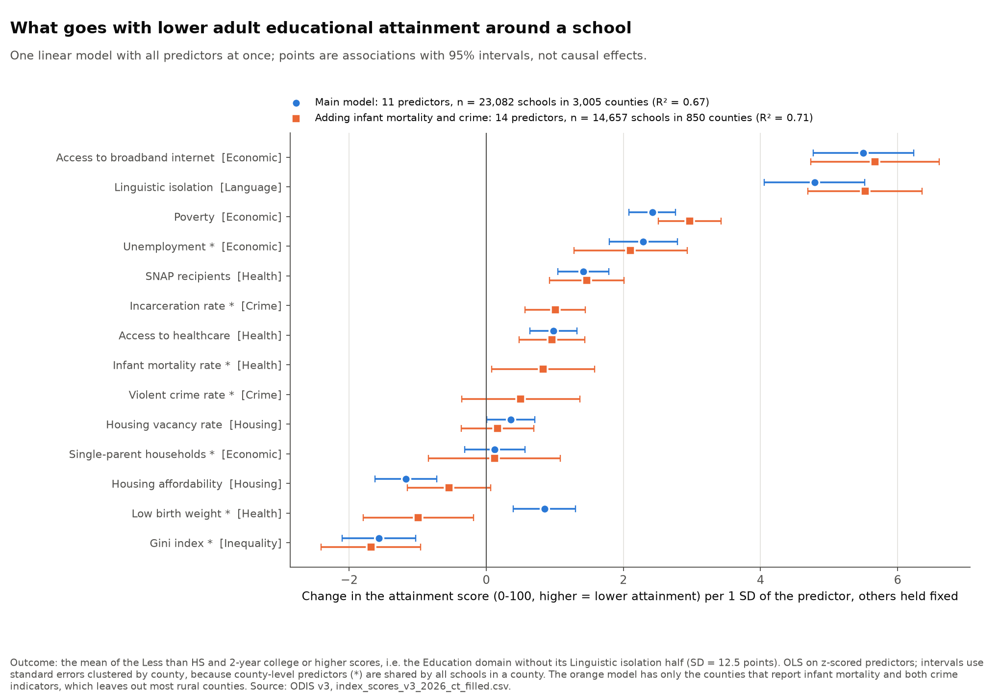
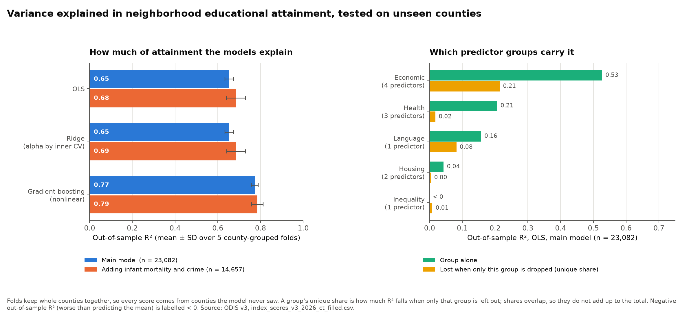

# Visualizations

Rendered charts from the exploratory analysis of the ODIS v3 dataset.
Each subfolder holds one analysis; you can read everything here without running any code.
The scripts that generate these files live in [`../analysis/`](../analysis/).

| Folder | Analysis |
| --- | --- |
| [`01-data-overview/`](01-data-overview/) | What the rows are, and how much data is missing in each row |
| [`02-connecticut-fix/`](02-connecticut-fix/) | Connecticut's missing values before and after the Connecticut fill |
| [`04-national-relationships/`](04-national-relationships/) | How the measures relate to each other nationally: correlations, dimensions of stress, and a model of adult educational attainment |

## Regenerating

From the repository root, with Python 3:

```sh
python3 -m venv .venv
.venv/bin/pip install -r requirements.txt
.venv/bin/python analysis/01_data_overview.py
.venv/bin/python analysis/02_connecticut_fix.py
.venv/bin/python analysis/04_national_relationships.py
```

`01_data_overview.py` reads `data/index_scores_v3_2026_fixed.csv` and overwrites the files in `visualizations/01-data-overview/`.
`02_connecticut_fix.py` compares that file with `data/index_scores_v3_2026_ct_filled.csv` and overwrites the files in `visualizations/02-connecticut-fix/`.
`04_national_relationships.py` reads `data/index_scores_v3_2026_ct_filled.csv` and overwrites the files in `visualizations/04-national-relationships/`; it takes about two minutes, mostly for the county-cluster bootstrap.
The output is deterministic; the random steps in `04_national_relationships.py` use a fixed seed.

## 01 - Data overview

All numbers below come from `data/index_scores_v3_2026_fixed.csv`, the version of the ODIS data with corrected 12-digit `NCESSCH` school IDs (see [`../data/README.md`](../data/README.md)).

### What the rows are

Each row is one US public high school (traditional, magnet, or charter), described by indicators of the neighborhood around it.
The indicators are synthesized to the school's School Attendance Boundary where one is available (`SAB Available` = 1 for 12,807 rows, 0 for 10,788).

- **Rows:** 23,595, one per school, each with a unique 12-digit `NCESSCH` ID.
- **Columns:** 58, in these groups:

| Group | Columns | What they hold |
| --- | ---: | --- |
| Identifiers | 9 | `NCESSCH`, `Name`, `School District`, `State`, `FIPS County Code`, `County`, `City`, `Zip Code`, `SAB Available` |
| Gini index | 1 | Income inequality |
| Domain scores | 6 | `Economic`, `Education`, `Health`, `Housing`, `Crime`, and their weighted average `Composite Score`, each 0-100 (higher = more community stress) |
| Percentile ranks | 6 | `<Domain> Percentile Rank` for each domain score and the composite |
| Medians | 6 | `<Domain> Median` for each domain score and the composite |
| Indicators | 20 | The inputs to the domain scores, such as `Unemployment`, `Poverty`, `Infant mortality rate`, `Lead exposure risk`, `Park access`, `Violent crime rate`, and educational attainment |
| Race and ethnicity | 8 | Population shares, for context only; they do not enter the index |
| Added by the NCESSCH fix | 2 | `NCESSCH_original` (the ID as downloaded) and `NCESSCH_status` (`intact` for 4,441 rows, `recovered` for 19,154) |

The rows cover 50 states, DC, and Puerto Rico.


California (2,221), Texas (1,918), and New York (1,192) have the most schools.
The median state has 324 rows; Hawaii, Delaware, and DC have fewer than 50 each.

### How much data is missing

A cell counts as missing if it is `N/A`, empty, or `Null`, the three forms the dataset uses:

| Form | Meaning | Cells |
| --- | --- | ---: |
| `N/A` | Missing in the input sources | 48,331 |
| Empty | A domain score or percentile rank that was not computed | 7,774 |
| `Null` | Defined in the ODIS README ("cannot be calculated due to missingness") | 0 |

That is 56,105 missing cells, 4.1% of all cells.
They sit in 35 of the 58 columns; the other 23 are always filled: all identifiers, the Gini index, the `Economic` and `Composite Score` columns and their ranks, all six medians, and `Unemployment`.
In particular, every row has a composite score, even when some of its domain scores are missing.

#### Missing cells per row


The average row is missing 2.4 cells (median 2).
The distribution is lumpy rather than smooth because columns go missing in fixed combinations: 4,688 rows miss exactly 2 cells, and 2,190 miss exactly 7.
No row misses between 12 and 25 cells, which gives a natural cut between "some" and "many".


| Band | Rows | Share |
| --- | ---: | ---: |
| None (0 missing) | 10,088 | 42.8% |
| Some (1-11 missing) | 13,222 | 56.0% |
| Many (26-35 missing) | 285 | 1.2% |

The 285 "many" rows lack nearly all census-based columns (education, race and ethnicity, poverty, housing).
96 of them, all in Connecticut, miss 35 cells: every domain score except `Economic`, so their `Composite Score` equals their `Economic` score.
The other 189 are spread across 39 states, led by Texas (27) and Idaho (19).

#### Which columns drive it


Two indicators account for most incomplete rows: `Lead exposure risk` (52.1% of rows missing) and `Park access` (51.9%).
Next come `Violent crime rate` (24.9%), `Infant mortality rate` (24.7%), and `Incarceration rate` (23.0%).
The `Crime` domain score and its rank are empty for 13.6% of rows.
Everything else is missing for 2.2% of rows or fewer.
Empty cells occur only in domain scores and percentile ranks; indicators use `N/A`.

Many columns go missing in exactly the same rows, so they behave as blocks:

| Block | Columns | Rows missing |
| --- | --- | ---: |
| Education | `Education` score and rank, the 5 attainment indicators, and the 8 race and ethnicity columns (15) | 285 |
| Housing | `Housing` score and rank, `Access to broadband internet`, `Linguistic isolation`, `Housing vacancy rate`, `Housing affordability` (6) | 287 |
| Poverty | `Poverty`, `Access to healthcare` (2) | 289 |
| Crime | `Crime` score and rank (2) | 3,219 |
| Health | `Health` score and rank (2) | 96 |

`Lead exposure risk` and `Park access` are nearly a block too: they differ in only 50 rows.


Only 42 distinct sets of missing columns occur, and the top 10 cover 94% of incomplete rows.
The single most common is `Lead exposure risk` + `Park access` alone (4,532 rows), which explains the spike at 2 in the histogram.
The spike at 7 is those two plus `Violent crime rate`, `Infant mortality rate`, `Incarceration rate`, and the `Crime` score and rank (2,189 rows).

#### Missingness by state


Missingness concentrates in particular states.
Connecticut averages 21.0 missing cells per row and Puerto Rico 9.0, against 2.4 overall.
Neither has any crime, lead, park, infant-mortality, low-birth-weight, or single-parent-household data, and 96 of Connecticut's 208 rows also lack all census-based columns.
Next come rural Plains and Mountain states (SD, VT, ID, MT, IA, NE, WY, KS, ND), each averaging about 5 missing cells per row.
DC (0.6), California (0.7), and Maryland (0.9) are the most complete.


The heatmap shows which gaps are national and which are regional:

- `Lead exposure risk` and `Park access` are missing across almost every state (only Hawaii and DC are nearly complete).
- `Incarceration rate` is missing for every row in Alaska, Connecticut, Delaware, Hawaii, Puerto Rico, Rhode Island, and Vermont, and for none in DC and seven states, including New York, Ohio, and Massachusetts.
- `Violent crime rate`, `Infant mortality rate`, and the `Crime` score are mostly missing in the rural Plains and Mountain states.
- The census-based blocks (education, housing, poverty) are rarely missing anywhere except Connecticut.

### Summary table

[`01-data-overview/missing_by_column.csv`](01-data-overview/missing_by_column.csv) lists all 58 columns with their group and the count of `N/A`, empty, and `Null` cells, the total, and the share of rows missing, sorted by the total.

## 02 - Connecticut fix

`data/index_scores_v3_2026_ct_filled.csv` fills Connecticut's missing values where current public data allows; [`../data/README.md`](../data/README.md#connecticut-fill) has the sources, method, and validation.
The charts compare its 208 Connecticut rows with the same rows in `data/index_scores_v3_2026_fixed.csv`.

### Per column


Before the fill, 35 columns are missing in Connecticut: 9 in all 208 rows and 26 in the 96 schools without a School Attendance Boundary.
After it, only 4 are: `Violent crime rate`, `Incarceration rate`, and the `Crime` score and its rank, which ODIS's crime sources do not cover for Connecticut.

| Filled | Rows | Source |
| --- | ---: | --- |
| 12 census indicators and 8 race and ethnicity columns | 96 | ACS 2019-2023, by ZIP, with ODIS's method |
| `Education`, `Health`, and `Housing` scores and ranks | 96 | Recomputed with ODIS's weights |
| `Single-parent households` | 208 | County Health Rankings 2025 |
| `Low birth weight`, `Infant mortality rate` | 208 | CT Department of Public Health, 2024 |
| `Lead exposure risk` | 208 | CHD lead index recomputed from ACS (approximation) |
| `Park access` | 208 | County Health Rankings 2025 Access to Parks (proxy) |

That is 3,536 filled cells; the Connecticut rows go from 4,368 missing cells to 832.
The `Economic`, `Health`, `Housing`, and `Composite Score` values that already existed are recomputed too, since they now include the new indicators.

### Per row


Before, Connecticut rows missed either 9 cells (112 schools with an SAB) or 35 (96 without).
After, every Connecticut row misses the same 4 crime cells.

### Against other states


Connecticut goes from the most incomplete state (21.0 missing cells per row) to 11th of 52 (4.0), next to the rural Plains and Mountain states.
Only Connecticut changes, and the all-rows average falls from 2.38 to 2.23 missing cells per row.

[`02-connecticut-fix/ct_missing_by_column.csv`](02-connecticut-fix/ct_missing_by_column.csv) lists, for each column, its group, the Connecticut rows missing it before and after, the count filled, and the `ct_fill_sources` keys that filled it.

## 04 - National relationships

How the ODIS measures relate to each other across the whole country: which kinds of neighborhood stress go together, how many separate dimensions there are, and what goes with low adult educational attainment around a school.
How these relationships differ between regions is the subject of section 03.
All numbers come from `data/index_scores_v3_2026_ct_filled.csv` (23,595 schools in 3,167 counties).

### Before reading the numbers

- **Every measure points the same way.** The domain scores and the indicators are all scaled 0-100 so that higher means more community stress.
  For example, a high `Access to broadband internet` value means *less* broadband, and a high `2-year college or higher` value means *fewer* adults with a degree.
  The indicators are scaled scores, not raw percentages.
  The `Gini index` is the one raw measure (income inequality, 0-1), and it does not enter the index.
- **Eight measures are county-level.** `Unemployment`, `Single-parent households`, `Infant mortality rate`, `Low birth weight`, `Violent crime rate`, `Incarceration rate`, the `Gini index`, and so the `Crime` domain take one value per county, shared by every school in it (marked `*` in the charts).
  Treating those schools as independent would overstate the evidence, so every interval below is either clustered by county or computed on county means.
- **Missing values are left missing.** Nothing is imputed.
  Each correlation uses the schools that have both measures, and each model or component analysis uses the schools that have all of its measures; every chart and table states its n.
  `Lead exposure risk` and `Park access` exist for only about half the schools, mostly in cities, and the crime and infant-mortality indicators for about three quarters, mostly outside rural counties.
- **The scores are built from each other.** A domain score is the equal-weight average of the indicators a school has (`Linguistic isolation` counts double in `Education`), and the `Composite Score` is the equal-weight average of the domains a school has.
  We checked this by regressing each score on its inputs (R² above 0.99 in every case).
  So a domain correlates with its own indicators, and the composite with its domains, partly by construction; see [Circularity](#circularity-what-is-built-in) below.
- **Race and ethnicity are not used.** Those columns are context only and are not part of the index, so they stay out of this analysis.

### Correlations between all measures



Spearman rank correlations between all 27 measures, with rows and columns grouped by how similar their correlations are.
n per pair ranges from 10,329 (pairs involving `Lead exposure risk` or `Park access`) to 23,595.
Outlined cells are pairs related by construction.
Most correlations (291 of 351) are positive: stresses tend to co-occur.
The clustering shows three families:

- **Education and connectivity:** the attainment shares, `Access to broadband internet`, `Poverty`, and the `Economic` and `Education` domains.
- **Family, health, and crime (all county-level):** `Single-parent households`, `Low birth weight`, `Infant mortality rate`, `Violent crime rate`, and the `Crime` domain.
- **Urban cost and language:** `Housing affordability`, `Linguistic isolation`, the `Gini index`, and the share with only a 2-year degree.

The third family runs *against* the rural stresses: `Housing affordability` correlates negatively with `Infant mortality rate` (ρ = -0.45), `Incarceration rate` (-0.37), and missing broadband (-0.35), and `Park access` (lack of parks) with `Lead exposure risk` (-0.53).
Expensive, crowded, immigrant neighborhoods and remote, depopulating ones are stressed in different ways.

### What is a meaningful p for a Spearman coefficient?

With this many schools, p alone is not meaningful: at n = 23,595 any |ρ| above 0.013 has p < 0.05, and 345 of the 351 pairs in the heatmap pass a Benjamini-Hochberg correction if every school is treated as independent.
Instead, a pair has to clear two separate bars:

1. **Statistically reliable:** Benjamini-Hochberg q < 0.05 across all 351 pairs, with p taken from a county-cluster bootstrap (200 resamples of whole counties) rather than from the naive formula, *and* a 95% cluster-bootstrap interval that excludes 0.
   The clustered intervals are typically about four times as wide as the naive ones, and about five times for pairs with a county-level measure, because schools in the same county resemble each other.
   321 of 351 pairs are reliable; the 24 pairs that are naive-significant but not reliable all have |ρ| < 0.1.
2. **Practically meaningful:** an effect size of at least moderate.

| Band | \|ρ\| | Pairs | Reliable |
| --- | --- | ---: | ---: |
| Negligible | < 0.1 | 60 | 30 |
| Weak | 0.1-0.3 | 130 | 130 |
| Moderate | 0.3-0.5 | 98 | 98 |
| Strong | ≥ 0.5 | 63 | 63 |

Every pair of at least weak strength is reliable, so here the effect size, not the p-value, is what separates findings from noise.
For scale: the smallest |ρ| detectable with 80% power at α = 0.05 is 0.018 with 23,595 schools, 0.028 with the 10,000 or so schools that have lead and park data, and 0.050 with about 3,100 counties, the effective sample for county-level measures.
[`spearman_pairs.csv`](04-national-relationships/spearman_pairs.csv) has, for every pair, ρ with its n, the cluster-bootstrap interval, naive and clustered p with their Benjamini-Hochberg q, the effective n and minimum detectable ρ, the strength band, whether the pair is related by construction, and the between- and within-county ρ.

### Which stresses go together across domains


The "which factors go together" story rests on pairs of indicators from *different* domains, which no construction ties together.
Of the 130 such pairs (the 17 index inputs plus the `Gini index`), 112 are reliable, and 51 are reliable and at least moderate: 13 strong and 38 moderate.
The strongest:

| Pair | ρ | 95% interval | n |
| --- | ---: | --- | ---: |
| `Single-parent households` * × `Violent crime rate` * | 0.75 | 0.68 to 0.79 | 17,716 |
| `Access to broadband internet` × `2-year college or higher` | 0.69 | 0.67 to 0.72 | 23,404 |
| `Single-parent households` * × `Low birth weight` * | 0.68 | 0.63 to 0.71 | 23,287 |
| `Low birth weight` * × `Violent crime rate` * | 0.67 | 0.60 to 0.73 | 17,716 |
| `Access to broadband internet` × `Housing vacancy rate` | 0.64 | 0.60 to 0.67 | 23,404 |
| `Linguistic isolation` × `Housing affordability` | 0.59 | 0.55 to 0.62 | 23,404 |
| `Lead exposure risk` × `Park access` | -0.53 | -0.58 to -0.46 | 11,509 |

The county-level pairs (`*`) rest on counties, not schools, and describe counties.

### The five domain scores



`Economic`, `Health`, `Crime`, and `Education` go together (ρ = 0.24 to 0.56), with `Economic` the most connected.
`Housing` barely moves with anything: ρ = 0.05 with `Health`, 0.07 with `Education`, and 0.17 with `Economic`.
The `Crime` scores pile up at 100 because the scaled crime indicators are truncated at 100.



A school-level correlation mixes two things: differences between counties and differences between schools in the same county.
Splitting them shows that the Housing correlations exist only between counties: within a county, schools with more housing stress have *slightly less* of the other stresses (ρ = -0.07 to -0.02).
`Education` and `Crime` are more closely linked between counties (0.40) than across schools (0.24); crime is only measured by county, so it cannot track the finer education differences inside one.
The other domain pairs are similar at every scale, so they are not an artifact of county-level data.

### Circularity: what is built in



Each domain score correlates with the composite partly because it is one fifth of it.
Leaving the domain out of the composite shows how much is real overlap:

| Domain | ρ with composite | ρ with the other domains' average |
| --- | ---: | ---: |
| Economic | 0.74 | 0.65 |
| Health | 0.65 | 0.53 |
| Crime | 0.82 | 0.49 |
| Education | 0.63 | 0.38 |
| Housing | 0.43 | 0.18 |

`Economic` is the domain most in line with the rest of the index; `Housing` adds the most independent information.

The same check on indicators shows that three domains do not measure one thing.
With the indicator removed, `Park access` (0.92 with its own domain as published) and `Lead exposure risk` (0.74) are unrelated to the rest of their domain (-0.06 and -0.02), and `Housing vacancy rate` is *negatively* related to the rest of `Housing` (-0.38).
Where `Park access` exists, it dominates the `Housing` score, because vacancy and affordability largely cancel each other out.
So a Housing score means something different for a school with park data (about half) than for one without.
[`leave_one_out.csv`](04-national-relationships/leave_one_out.csv) has all 22 comparisons.

### How many dimensions of stress



A principal component analysis asks how many independent patterns explain the indicators.
The main run uses the 12 indicators that are missing for 2% of schools or fewer (n = 23,082 schools with all 12), after a rank transform so it follows the Spearman correlations.
Horn's parallel analysis keeps 4 components, which together explain 71% of the variance; the first explains only 29%.
Adding infant mortality and the two crime indicators (15 indicators, n = 14,657) or all 17 index inputs (n = 10,088) also gives 4 components and 70-71%.



After a varimax rotation the four dimensions are:

| Main-run component | Loads on (loading) | Plain reading |
| --- | --- | --- |
| RC1 | no degree (0.85), missing broadband (0.84), no HS diploma (0.76), vacancy (0.62), uninsured children (0.50) | Low attainment and weak connectivity, typical of rural and depopulating areas |
| RC2 | linguistic isolation (0.87), housing affordability (0.80), no HS diploma (0.44), unemployment (0.41); vacancy (-0.43) | Crowded, expensive, immigrant neighborhoods |
| RC3 | low birth weight (0.90), single-parent households (0.87) | Family and birth-health stress (county-level) |
| RC4 | SNAP recipients (0.87), child poverty (0.70) | Household poverty |

The 15-indicator run reproduces all four (Tucker congruence 0.97-0.99 with the main run), with `Infant mortality rate` and `Violent crime rate` joining the family-and-health dimension.
The 17-indicator run, which only has city-heavy schools, reproduces the first three less closely (0.82-0.93), and its fourth dimension becomes vacancy, missing broadband, and lead exposure instead of poverty.
The first unrotated component correlates 0.83 with the `Composite Score`, so the composite is close to a single "overall stress" summary, but it averages over dimensions that point in different directions.
[`pca_loadings.csv`](04-national-relationships/pca_loadings.csv) has every loading, with the matched main-run component and its congruence.

### What goes with low adult educational attainment



The outcome is the attainment half of the `Education` domain: the mean of the `Less than HS` and `2-year college or higher` scores (0-100, higher = fewer adults with a diploma or degree; SD 12.5 points).
The predictors are the 11 indicators with 2% missing or fewer that are not attainment measures, including `Linguistic isolation` (the other half of `Education`) and the `Gini index`.
Each coefficient is the change in the attainment score for a one-standard-deviation higher predictor, holding the others fixed, with 95% intervals clustered by county.
Main model: n = 23,082 schools in 3,005 counties, R² = 0.67.

| Predictor | Points per SD | 95% interval |
| --- | ---: | --- |
| `Access to broadband internet` (missing broadband) | +5.5 | 4.8 to 6.2 |
| `Linguistic isolation` | +4.8 | 4.1 to 5.5 |
| `Poverty` | +2.4 | 2.1 to 2.8 |
| `Unemployment` * | +2.3 | 1.8 to 2.8 |
| `SNAP recipients` | +1.4 | 1.0 to 1.8 |
| `Access to healthcare` (uninsured children) | +1.0 | 0.6 to 1.3 |
| `Low birth weight` * | +0.8 | 0.4 to 1.3 |
| `Housing vacancy rate` | +0.4 | 0.0 to 0.7 |
| `Single-parent households` * | +0.1 | -0.3 to 0.6 |
| `Housing affordability` | -1.2 | -1.6 to -0.7 |
| `Gini index` * | -1.6 | -2.1 to -1.0 |

Missing broadband and linguistic isolation carry the most weight, followed by poverty and unemployment.
Higher housing-cost stress and higher inequality go with *more* degrees once the rest is held fixed: those are features of expensive metropolitan areas.
These are associations across neighborhoods, not causal effects.

The extended model adds `Infant mortality rate`, `Violent crime rate`, and `Incarceration rate` (n = 14,657 schools, R² = 0.71).
It covers only the 850 counties that report all three, which leaves out most rural counties, so it is a check rather than the headline.
The main coefficients keep their size and sign except `Low birth weight`, which flips to -1.0 (-1.8 to -0.2): with infant mortality and violent crime in the model, the three county-level health and crime measures are too correlated to separate.
Of the new predictors, `Incarceration rate` (+1.0, 0.6 to 1.4) and `Infant mortality rate` (+0.8, 0.1 to 1.6) are nonzero and `Violent crime rate` is not.

**Multicollinearity** is low: the largest variance inflation factor is 2.6 in the main model (`Single-parent households`) and 4.1 in the extended one, and the condition numbers of the standardized predictors are 3.3 and 5.0.
Clustering by state instead of county widens the intervals, but only `Housing vacancy rate` would lose significance.



Variance explained is measured on counties the model never saw (5-fold cross-validation with whole counties held out):

- The linear model explains 65% (±2%) of attainment differences; a cross-validated ridge regression gives the same, as expected with few, weakly correlated predictors.
- A gradient-boosting model explains 77% (±2%), so part of the relationship is nonlinear or depends on combinations of predictors.
- On county means (one row per county, n = 3,005), the linear model explains 65%, so the school-level result is not driven by repeating county values.
- The four economic indicators alone explain 53%; they also carry the largest unique share (21 points lost when only they are dropped), followed by `Linguistic isolation` (8 points).
  Health adds 2 points beyond the rest, housing and inequality about 1 or less, and in the extended model crime adds nothing (0.2 points) once economics is known.

[`attainment_model_coefficients.csv`](04-national-relationships/attainment_model_coefficients.csv) has every coefficient for the main model, the extended model, and the county-means model, with county-clustered, state-clustered, and naive standard errors and the variance inflation factors.
[`attainment_model_cv.csv`](04-national-relationships/attainment_model_cv.csv) has the cross-validated R² for every model and predictor group.

### Caveats

- Everything here is correlational and cross-sectional, and describes neighborhoods, not individual students or families.
- The indicators are ODIS's scaled 0-100 scores, some truncated at 0 or 100, so effects are in scaled points, not percentages.
- County-level measures carry one value per county; conclusions about them are conclusions about counties.
- The samples differ by analysis because missingness is not random: lead and park data are city-heavy, and crime and infant-mortality data are thin in rural counties.
- Connecticut's filled values for `Lead exposure risk` and `Park access` are approximations (see [`../data/README.md`](../data/README.md#connecticut-fill)); they are 208 of 23,595 rows.
- Domain and composite scores average whatever components a school has, so the same score can mix different ingredients for different schools.

### National headline findings

1. **Community stress is not one thing.** Four separate dimensions explain 71% of the variation in the indicators, and the biggest explains only 29%: low attainment with weak connectivity, expensive immigrant neighborhoods, family and birth-health stress, and household poverty.
2. **The digital divide tracks the education divide.** Missing broadband is the strongest correlate of low adult attainment (ρ = 0.69) and its strongest predictor with everything else held fixed (+5.5 points per SD); non-education indicators explain 65% of attainment differences in counties the model never saw.
3. **Housing stress stands apart.** The Housing domain correlates at most 0.17 with any other domain, is flat or slightly negative within counties, and only 0.18 with the rest of the composite; its own indicators pull in opposite directions.
4. **Family structure, birth health, and violent crime move together at the county level** (ρ = 0.67 to 0.75), the tightest cross-domain cluster in the data.
5. **With 23,595 schools, significance is cheap.** Any |ρ| above 0.013 is "significant"; 321 of 351 pairs survive a county-clustered, multiple-testing-corrected test, so effect size is what matters: 51 of 130 cross-domain indicator pairs are both reliable and at least moderate.
