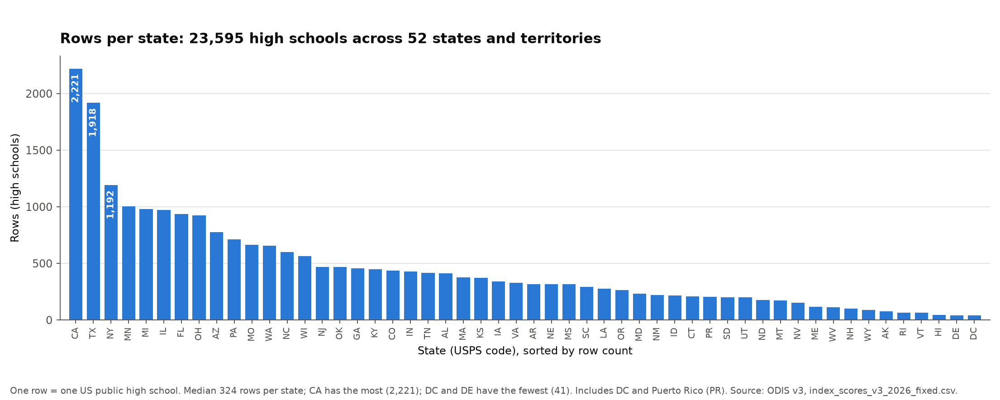
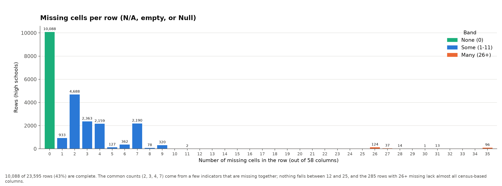
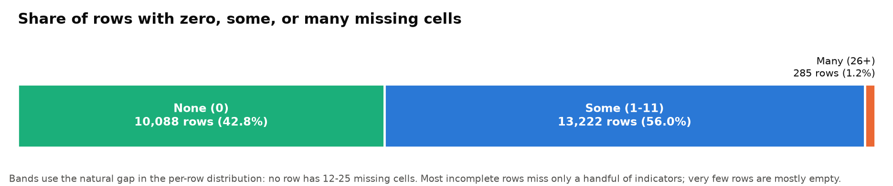
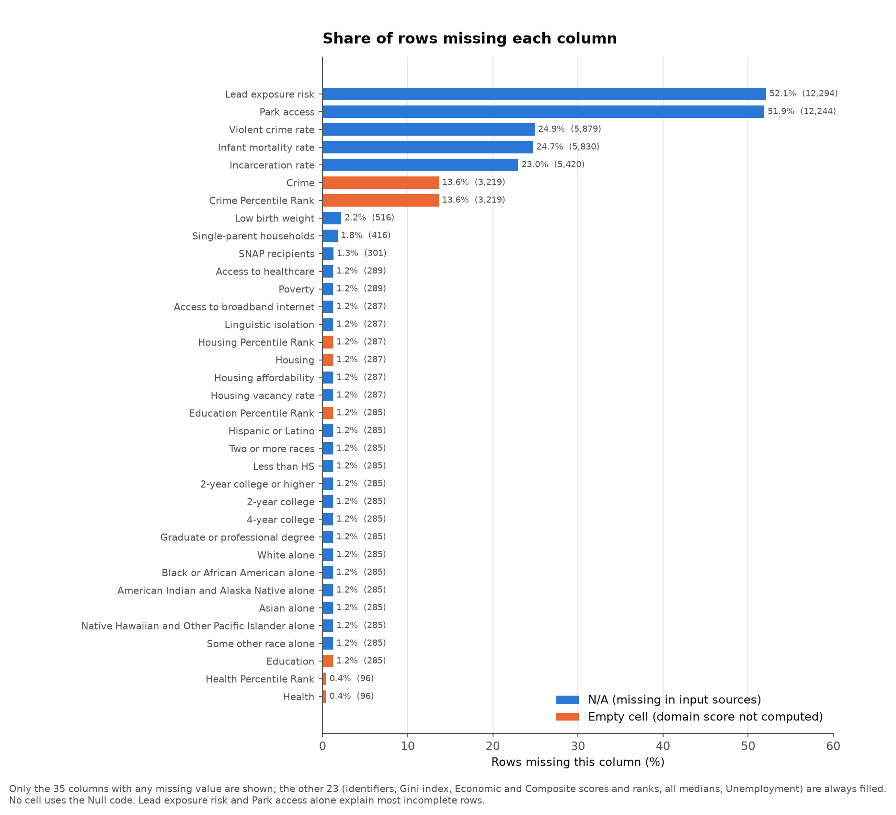
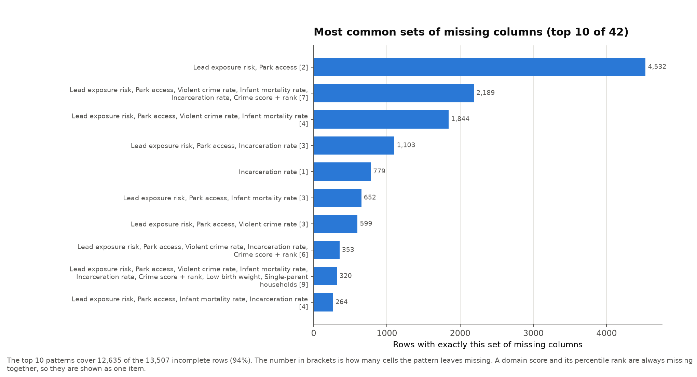
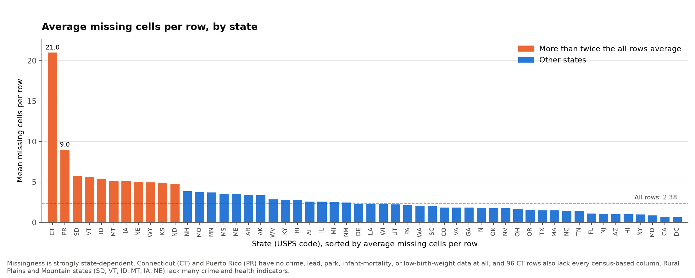
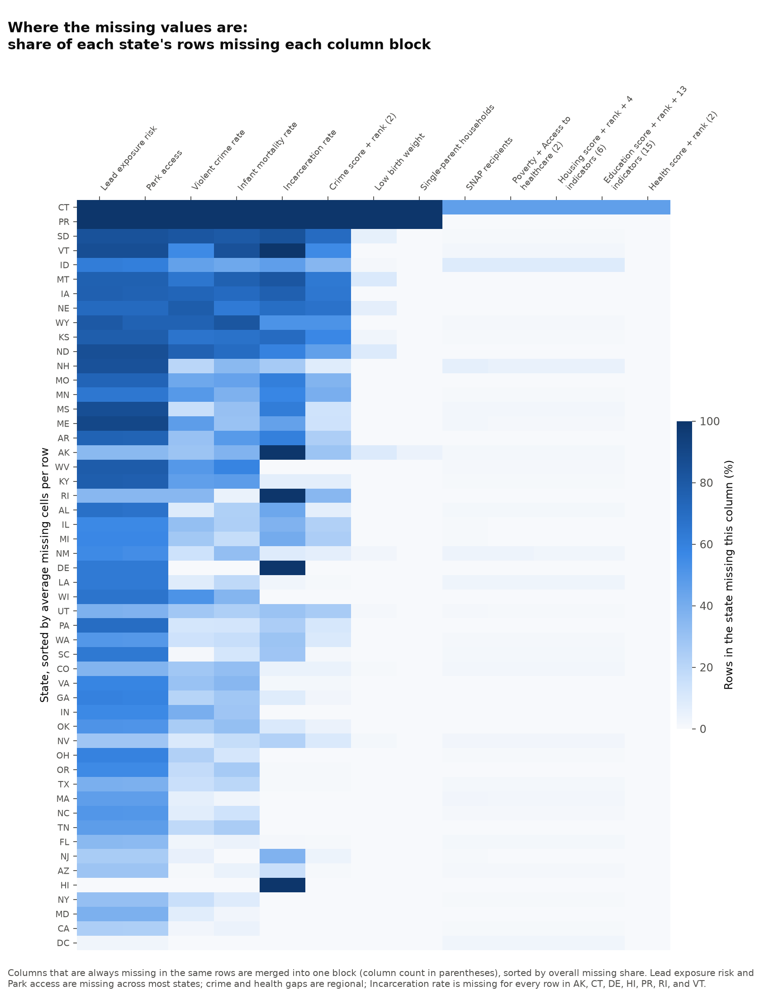
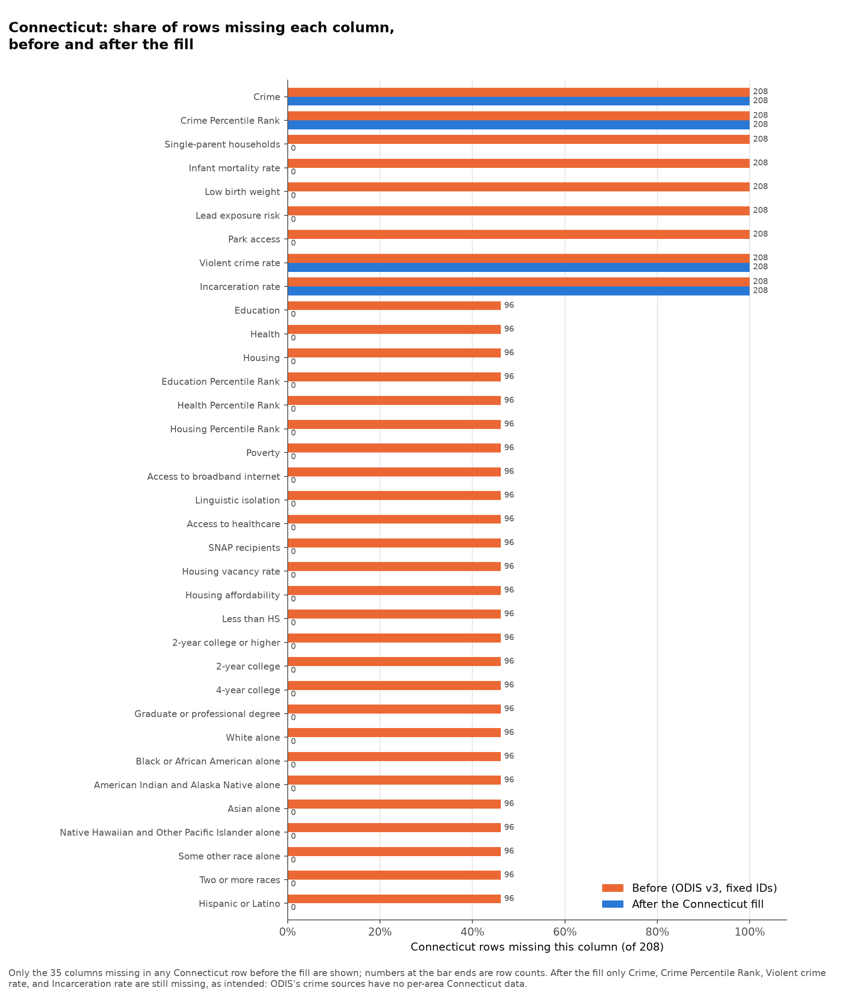
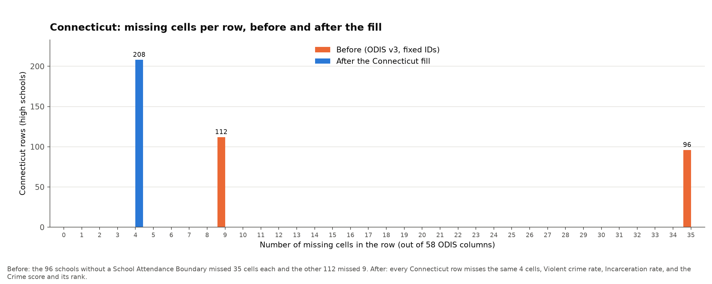
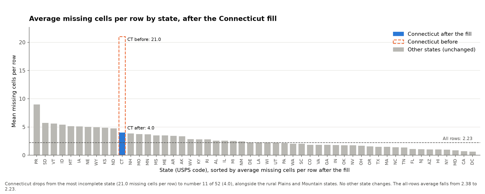

# Visualizations

Rendered charts from the exploratory analysis of the ODIS v3 dataset.
Each subfolder holds one analysis; you can read everything here without running any code.
The scripts that generate these files live in [`../analysis/`](../analysis/).

| Folder | Analysis |
| --- | --- |
| [`01-data-overview/`](01-data-overview/) | What the rows are, and how much data is missing in each row |
| [`02-connecticut-fix/`](02-connecticut-fix/) | Connecticut's missing values before and after the Connecticut fill |

## Regenerating

From the repository root, with Python 3:

```sh
python3 -m venv .venv
.venv/bin/pip install -r requirements.txt
.venv/bin/python analysis/01_data_overview.py
.venv/bin/python analysis/02_connecticut_fix.py
```

`01_data_overview.py` reads `data/index_scores_v3_2026_fixed.csv` and overwrites the files in `visualizations/01-data-overview/`.
`02_connecticut_fix.py` compares that file with `data/index_scores_v3_2026_ct_filled.csv` and overwrites the files in `visualizations/02-connecticut-fix/`.
The output is deterministic.

## 01 - Data overview

All numbers below come from `data/index_scores_v3_2026_fixed.csv`, the version of the ODIS data with corrected 12-digit `NCESSCH` school IDs (see [`../data/README.md`](../data/README.md)).

### What the rows are

Each row is one US public high school (traditional, magnet, or charter), described by indicators of the neighborhood around it.
The indicators are synthesized to the school's School Attendance Boundary where one is available (`SAB Available` = 1 for 12,807 rows, 0 for 10,788).

- **Rows:** 23,595, one per school, each with a unique 12-digit `NCESSCH` ID.
- **Columns:** 58, in these groups:

| Group | Columns | What they hold |
| --- | ---: | --- |
| Identifiers | 9 | `NCESSCH`, `Name`, `School District`, `State`, `FIPS County Code`, `County`, `City`, `Zip Code`, `SAB Available` |
| Gini index | 1 | Income inequality |
| Domain scores | 6 | `Economic`, `Education`, `Health`, `Housing`, `Crime`, and their weighted average `Composite Score`, each 0-100 (higher = more community stress) |
| Percentile ranks | 6 | `<Domain> Percentile Rank` for each domain score and the composite |
| Medians | 6 | `<Domain> Median` for each domain score and the composite |
| Indicators | 20 | The inputs to the domain scores, such as `Unemployment`, `Poverty`, `Infant mortality rate`, `Lead exposure risk`, `Park access`, `Violent crime rate`, and educational attainment |
| Race and ethnicity | 8 | Population shares, for context only; they do not enter the index |
| Added by the NCESSCH fix | 2 | `NCESSCH_original` (the ID as downloaded) and `NCESSCH_status` (`intact` for 4,441 rows, `recovered` for 19,154) |

The rows cover 50 states, DC, and Puerto Rico.



California (2,221), Texas (1,918), and New York (1,192) have the most schools.
The median state has 324 rows; Hawaii, Delaware, and DC have fewer than 50 each.

### How much data is missing

A cell counts as missing if it is `N/A`, empty, or `Null`, the three forms the dataset uses:

| Form | Meaning | Cells |
| --- | --- | ---: |
| `N/A` | Missing in the input sources | 48,331 |
| Empty | A domain score or percentile rank that was not computed | 7,774 |
| `Null` | Defined in the ODIS README ("cannot be calculated due to missingness") | 0 |

That is 56,105 missing cells, 4.1% of all cells.
They sit in 35 of the 58 columns; the other 23 are always filled: all identifiers, the Gini index, the `Economic` and `Composite Score` columns and their ranks, all six medians, and `Unemployment`.
In particular, every row has a composite score, even when some of its domain scores are missing.

#### Missing cells per row



The average row is missing 2.4 cells (median 2).
The distribution is lumpy rather than smooth because columns go missing in fixed combinations: 4,688 rows miss exactly 2 cells, and 2,190 miss exactly 7.
No row misses between 12 and 25 cells, which gives a natural cut between "some" and "many".



| Band | Rows | Share |
| --- | ---: | ---: |
| None (0 missing) | 10,088 | 42.8% |
| Some (1-11 missing) | 13,222 | 56.0% |
| Many (26-35 missing) | 285 | 1.2% |

The 285 "many" rows lack nearly all census-based columns (education, race and ethnicity, poverty, housing).
96 of them, all in Connecticut, miss 35 cells: every domain score except `Economic`, so their `Composite Score` equals their `Economic` score.
The other 189 are spread across 39 states, led by Texas (27) and Idaho (19).

#### Which columns drive it



Two indicators account for most incomplete rows: `Lead exposure risk` (52.1% of rows missing) and `Park access` (51.9%).
Next come `Violent crime rate` (24.9%), `Infant mortality rate` (24.7%), and `Incarceration rate` (23.0%).
The `Crime` domain score and its rank are empty for 13.6% of rows.
Everything else is missing for 2.2% of rows or fewer.
Empty cells occur only in domain scores and percentile ranks; indicators use `N/A`.

Many columns go missing in exactly the same rows, so they behave as blocks:

| Block | Columns | Rows missing |
| --- | --- | ---: |
| Education | `Education` score and rank, the 5 attainment indicators, and the 8 race and ethnicity columns (15) | 285 |
| Housing | `Housing` score and rank, `Access to broadband internet`, `Linguistic isolation`, `Housing vacancy rate`, `Housing affordability` (6) | 287 |
| Poverty | `Poverty`, `Access to healthcare` (2) | 289 |
| Crime | `Crime` score and rank (2) | 3,219 |
| Health | `Health` score and rank (2) | 96 |

`Lead exposure risk` and `Park access` are nearly a block too: they differ in only 50 rows.



Only 42 distinct sets of missing columns occur, and the top 10 cover 94% of incomplete rows.
The single most common is `Lead exposure risk` + `Park access` alone (4,532 rows), which explains the spike at 2 in the histogram.
The spike at 7 is those two plus `Violent crime rate`, `Infant mortality rate`, `Incarceration rate`, and the `Crime` score and rank (2,189 rows).

#### Missingness by state



Missingness concentrates in particular states.
Connecticut averages 21.0 missing cells per row and Puerto Rico 9.0, against 2.4 overall.
Neither has any crime, lead, park, infant-mortality, low-birth-weight, or single-parent-household data, and 96 of Connecticut's 208 rows also lack all census-based columns.
Next come rural Plains and Mountain states (SD, VT, ID, MT, IA, NE, WY, KS, ND), each averaging about 5 missing cells per row.
DC (0.6), California (0.7), and Maryland (0.9) are the most complete.



The heatmap shows which gaps are national and which are regional:

- `Lead exposure risk` and `Park access` are missing across almost every state (only Hawaii and DC are nearly complete).
- `Incarceration rate` is missing for every row in Alaska, Connecticut, Delaware, Hawaii, Puerto Rico, Rhode Island, and Vermont, and for none in DC and seven states, including New York, Ohio, and Massachusetts.
- `Violent crime rate`, `Infant mortality rate`, and the `Crime` score are mostly missing in the rural Plains and Mountain states.
- The census-based blocks (education, housing, poverty) are rarely missing anywhere except Connecticut.

### Summary table

[`01-data-overview/missing_by_column.csv`](01-data-overview/missing_by_column.csv) lists all 58 columns with their group and the count of `N/A`, empty, and `Null` cells, the total, and the share of rows missing, sorted by the total.

## 02 - Connecticut fix

`data/index_scores_v3_2026_ct_filled.csv` fills Connecticut's missing values where current public data allows; [`../data/README.md`](../data/README.md#connecticut-fill) has the sources, method, and validation.
The charts compare its 208 Connecticut rows with the same rows in `data/index_scores_v3_2026_fixed.csv`.

### Per column



Before the fill, 35 columns are missing in Connecticut: 9 in all 208 rows and 26 in the 96 schools without a School Attendance Boundary.
After it, only 4 are: `Violent crime rate`, `Incarceration rate`, and the `Crime` score and its rank, which ODIS's crime sources do not cover for Connecticut.

| Filled | Rows | Source |
| --- | ---: | --- |
| 12 census indicators and 8 race and ethnicity columns | 96 | ACS 2019-2023, by ZIP, with ODIS's method |
| `Education`, `Health`, and `Housing` scores and ranks | 96 | Recomputed with ODIS's weights |
| `Single-parent households` | 208 | County Health Rankings 2025 |
| `Low birth weight`, `Infant mortality rate` | 208 | CT Department of Public Health, 2024 |
| `Lead exposure risk` | 208 | CHD lead index recomputed from ACS (approximation) |
| `Park access` | 208 | County Health Rankings 2025 Access to Parks (proxy) |

That is 3,536 filled cells; the Connecticut rows go from 4,368 missing cells to 832.
The `Economic`, `Health`, `Housing`, and `Composite Score` values that already existed are recomputed too, since they now include the new indicators.

### Per row



Before, Connecticut rows missed either 9 cells (112 schools with an SAB) or 35 (96 without).
After, every Connecticut row misses the same 4 crime cells.

### Against other states



Connecticut goes from the most incomplete state (21.0 missing cells per row) to 11th of 52 (4.0), next to the rural Plains and Mountain states.
Only Connecticut changes, and the all-rows average falls from 2.38 to 2.23 missing cells per row.

[`02-connecticut-fix/ct_missing_by_column.csv`](02-connecticut-fix/ct_missing_by_column.csv) lists, for each column, its group, the Connecticut rows missing it before and after, the count filled, and the `ct_fill_sources` keys that filled it.
