# Visualizations

Rendered charts from the exploratory analysis of the ODIS v3 dataset.
Each subfolder holds one analysis; you can read everything here without running any code.
The scripts that generate these files live in [`../analysis/`](../analysis/).

| Folder | Analysis |
| --- | --- |
| [`01-data-overview/`](01-data-overview/) | What the rows are, and how much data is missing in each row |
| [`02-connecticut-fix/`](02-connecticut-fix/) | Connecticut's missing values before and after the Connecticut fill |
| [`03-regional-variation/`](03-regional-variation/) | How the scores, the relationships between them, and what drives overall stress differ between US regions |
| [`04-national-relationships/`](04-national-relationships/) | How the measures relate to each other nationally: correlations, dimensions of stress, and a model of adult educational attainment |
| [`05-regional-weights/`](05-regional-weights/) | How much each domain predicts high school graduation in each region, and a regionally weighted stress score next to the ODIS composite |

## Regenerating

From the repository root, with Python 3:

```sh
python3 -m venv .venv
.venv/bin/pip install -r requirements.txt
.venv/bin/python analysis/01_data_overview.py
.venv/bin/python analysis/02_connecticut_fix.py
.venv/bin/python analysis/03_regional_variation.py
.venv/bin/python analysis/04_national_relationships.py
.venv/bin/python analysis/05_regional_weights.py
```

`01_data_overview.py` reads `data/index_scores_v3_2026_fixed.csv` and overwrites the files in `visualizations/01-data-overview/`.
`02_connecticut_fix.py` compares that file with `data/index_scores_v3_2026_ct_filled.csv` and overwrites the files in `visualizations/02-connecticut-fix/`.
`03_regional_variation.py` reads `data/index_scores_v3_2026_ct_filled.csv` and overwrites the files in `visualizations/03-regional-variation/`; it takes about three minutes, mostly bootstrapping.
`04_national_relationships.py` reads `data/index_scores_v3_2026_ct_filled.csv` and overwrites the files in `visualizations/04-national-relationships/`; it takes about two minutes, mostly for the county-cluster bootstrap.
`05_regional_weights.py` joins the federal graduation rates onto `data/index_scores_v3_2026_ct_filled.csv` (it does not modify it), writes the two new files in `data/derived/`, and overwrites the files in `visualizations/05-regional-weights/`; it needs the graduation-rate file described in [`../data/README.md`](../data/README.md#derived-graduation-rates-and-regional-weights) and takes about ten seconds.
The output is deterministic; the random steps in `03_regional_variation.py`, `04_national_relationships.py`, and `05_regional_weights.py` use a fixed seed.

## 01 - Data overview

All numbers below come from `data/index_scores_v3_2026_fixed.csv`, the version of the ODIS data with corrected 12-digit `NCESSCH` school IDs (see [`../data/README.md`](../data/README.md)).

### What the rows are

Each row is one US public high school (traditional, magnet, or charter), described by indicators of the neighborhood around it.
The indicators are synthesized to the school's School Attendance Boundary where one is available (`SAB Available` = 1 for 12,807 rows, 0 for 10,788).

- **Rows:** 23,595, one per school, each with a unique 12-digit `NCESSCH` ID.
- **Columns:** 58, in these groups:

| Group | Columns | What they hold |
| --- | ---: | --- |
| Identifiers | 9 | `NCESSCH`, `Name`, `School District`, `State`, `FIPS County Code`, `County`, `City`, `Zip Code`, `SAB Available` |
| Gini index | 1 | Income inequality |
| Domain scores | 6 | `Economic`, `Education`, `Health`, `Housing`, `Crime`, and their weighted average `Composite Score`, each 0-100 (higher = more community stress) |
| Percentile ranks | 6 | `<Domain> Percentile Rank` for each domain score and the composite |
| Medians | 6 | `<Domain> Median` for each domain score and the composite |
| Indicators | 20 | The inputs to the domain scores, such as `Unemployment`, `Poverty`, `Infant mortality rate`, `Lead exposure risk`, `Park access`, `Violent crime rate`, and educational attainment |
| Race and ethnicity | 8 | Population shares, for context only; they do not enter the index |
| Added by the NCESSCH fix | 2 | `NCESSCH_original` (the ID as downloaded) and `NCESSCH_status` (`intact` for 4,441 rows, `recovered` for 19,154) |

The rows cover 50 states, DC, and Puerto Rico.


California (2,221), Texas (1,918), and New York (1,192) have the most schools.
The median state has 324 rows; Hawaii, Delaware, and DC have fewer than 50 each.

### How much data is missing

A cell counts as missing if it is `N/A`, empty, or `Null`, the three forms the dataset uses:

| Form | Meaning | Cells |
| --- | --- | ---: |
| `N/A` | Missing in the input sources | 48,331 |
| Empty | A domain score or percentile rank that was not computed | 7,774 |
| `Null` | Defined in the ODIS README ("cannot be calculated due to missingness") | 0 |

That is 56,105 missing cells, 4.1% of all cells.
They sit in 35 of the 58 columns; the other 23 are always filled: all identifiers, the Gini index, the `Economic` and `Composite Score` columns and their ranks, all six medians, and `Unemployment`.
In particular, every row has a composite score, even when some of its domain scores are missing.

#### Missing cells per row


The average row is missing 2.4 cells (median 2).
The distribution is lumpy rather than smooth because columns go missing in fixed combinations: 4,688 rows miss exactly 2 cells, and 2,190 miss exactly 7.
No row misses between 12 and 25 cells, which gives a natural cut between "some" and "many".


| Band | Rows | Share |
| --- | ---: | ---: |
| None (0 missing) | 10,088 | 42.8% |
| Some (1-11 missing) | 13,222 | 56.0% |
| Many (26-35 missing) | 285 | 1.2% |

The 285 "many" rows lack nearly all census-based columns (education, race and ethnicity, poverty, housing).
96 of them, all in Connecticut, miss 35 cells: every domain score except `Economic`, so their `Composite Score` equals their `Economic` score.
The other 189 are spread across 39 states, led by Texas (27) and Idaho (19).

#### Which columns drive it


Two indicators account for most incomplete rows: `Lead exposure risk` (52.1% of rows missing) and `Park access` (51.9%).
Next come `Violent crime rate` (24.9%), `Infant mortality rate` (24.7%), and `Incarceration rate` (23.0%).
The `Crime` domain score and its rank are empty for 13.6% of rows.
Everything else is missing for 2.2% of rows or fewer.
Empty cells occur only in domain scores and percentile ranks; indicators use `N/A`.

Many columns go missing in exactly the same rows, so they behave as blocks:

| Block | Columns | Rows missing |
| --- | --- | ---: |
| Education | `Education` score and rank, the 5 attainment indicators, and the 8 race and ethnicity columns (15) | 285 |
| Housing | `Housing` score and rank, `Access to broadband internet`, `Linguistic isolation`, `Housing vacancy rate`, `Housing affordability` (6) | 287 |
| Poverty | `Poverty`, `Access to healthcare` (2) | 289 |
| Crime | `Crime` score and rank (2) | 3,219 |
| Health | `Health` score and rank (2) | 96 |

`Lead exposure risk` and `Park access` are nearly a block too: they differ in only 50 rows.


Only 42 distinct sets of missing columns occur, and the top 10 cover 94% of incomplete rows.
The single most common is `Lead exposure risk` + `Park access` alone (4,532 rows), which explains the spike at 2 in the histogram.
The spike at 7 is those two plus `Violent crime rate`, `Infant mortality rate`, `Incarceration rate`, and the `Crime` score and rank (2,189 rows).

#### Missingness by state


Missingness concentrates in particular states.
Connecticut averages 21.0 missing cells per row and Puerto Rico 9.0, against 2.4 overall.
Neither has any crime, lead, park, infant-mortality, low-birth-weight, or single-parent-household data, and 96 of Connecticut's 208 rows also lack all census-based columns.
Next come rural Plains and Mountain states (SD, VT, ID, MT, IA, NE, WY, KS, ND), each averaging about 5 missing cells per row.
DC (0.6), California (0.7), and Maryland (0.9) are the most complete.


The heatmap shows which gaps are national and which are regional:

- `Lead exposure risk` and `Park access` are missing across almost every state (only Hawaii and DC are nearly complete).
- `Incarceration rate` is missing for every row in Alaska, Connecticut, Delaware, Hawaii, Puerto Rico, Rhode Island, and Vermont, and for none in DC and seven states, including New York, Ohio, and Massachusetts.
- `Violent crime rate`, `Infant mortality rate`, and the `Crime` score are mostly missing in the rural Plains and Mountain states.
- The census-based blocks (education, housing, poverty) are rarely missing anywhere except Connecticut.

### Summary table

[`01-data-overview/missing_by_column.csv`](01-data-overview/missing_by_column.csv) lists all 58 columns with their group and the count of `N/A`, empty, and `Null` cells, the total, and the share of rows missing, sorted by the total.

## 02 - Connecticut fix

`data/index_scores_v3_2026_ct_filled.csv` fills Connecticut's missing values where current public data allows; [`../data/README.md`](../data/README.md#connecticut-fill) has the sources, method, and validation.
The charts compare its 208 Connecticut rows with the same rows in `data/index_scores_v3_2026_fixed.csv`.

### Per column


Before the fill, 35 columns are missing in Connecticut: 9 in all 208 rows and 26 in the 96 schools without a School Attendance Boundary.
After it, only 4 are: `Violent crime rate`, `Incarceration rate`, and the `Crime` score and its rank, which ODIS's crime sources do not cover for Connecticut.

| Filled | Rows | Source |
| --- | ---: | --- |
| 12 census indicators and 8 race and ethnicity columns | 96 | ACS 2019-2023, by ZIP, with ODIS's method |
| `Education`, `Health`, and `Housing` scores and ranks | 96 | Recomputed with ODIS's weights |
| `Single-parent households` | 208 | County Health Rankings 2025 |
| `Low birth weight`, `Infant mortality rate` | 208 | CT Department of Public Health, 2024 |
| `Lead exposure risk` | 208 | CHD lead index recomputed from ACS (approximation) |
| `Park access` | 208 | County Health Rankings 2025 Access to Parks (proxy) |

That is 3,536 filled cells; the Connecticut rows go from 4,368 missing cells to 832.
The `Economic`, `Health`, `Housing`, and `Composite Score` values that already existed are recomputed too, since they now include the new indicators.

### Per row


Before, Connecticut rows missed either 9 cells (112 schools with an SAB) or 35 (96 without).
After, every Connecticut row misses the same 4 crime cells.

### Against other states


Connecticut goes from the most incomplete state (21.0 missing cells per row) to 11th of 52 (4.0), next to the rural Plains and Mountain states.
Only Connecticut changes, and the all-rows average falls from 2.38 to 2.23 missing cells per row.

[`02-connecticut-fix/ct_missing_by_column.csv`](02-connecticut-fix/ct_missing_by_column.csv) lists, for each column, its group, the Connecticut rows missing it before and after, the count filled, and the `ct_fill_sources` keys that filled it.

## 03 - Regional variation

How do the ODIS scores differ from one part of the country to another, and does the relationship between two scores change with the region?
All numbers below come from `data/index_scores_v3_2026_ct_filled.csv` (23,595 schools; see [`../data/README.md`](../data/README.md#connecticut-fill)).
The scores are 0-100, and higher means more community stress.

### The regions

The regions start from the Census Bureau's regions and divisions and split out the areas the project asked about.
[`03-regional-variation/regions.csv`](03-regional-variation/regions.csv) lists every state with its Census region, Census division, analysis region, and school and county counts.

| Analysis region | States | Based on |
| --- | --- | --- |
| Northeast | CT, ME, MA, NH, RI, VT, NJ, NY, PA | Census Northeast (New England + Middle Atlantic) |
| Midwest | IL, IN, MI, OH, WI, IA, KS, MN, MO, NE, ND, SD | Census Midwest; this is the "North" as distinct from the Northeast |
| South | DE, DC, FL, GA, MD, NC, SC, VA, WV, AL, KY, MS, TN, AR, LA, OK, TX | Census South |
| Pacific Northwest | WA, OR, ID | WA and OR from the Census Pacific division, ID from the Mountain division |
| California | CA | Census Pacific division, on its own |
| Mountain & Southwest | AZ, CO, MT, NV, NM, UT, WY | Census Mountain division without ID |
| Alaska | AK | Census Pacific division, on its own |
| Hawaii | HI | Census Pacific division, on its own |
| Puerto Rico | PR | Not in any Census region |

Alaska, Hawaii, and Puerto Rico are kept as their own groups rather than folded into a region they have little in common with.
They are shown everywhere, but with 76, 43, and 205 schools their estimates are much less certain, and they are left out of the formal tests of whether correlations differ.

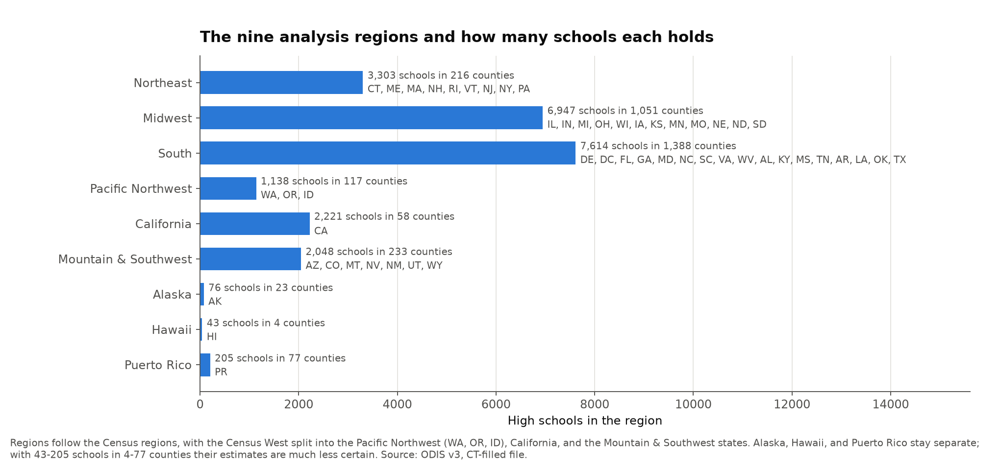

The South (7,614 schools) and the Midwest (6,947) hold 62% of all schools, so a national median mostly describes those two regions.
California has 2,221 schools but only 58 counties, which matters for its uncertainty (see [Methods](#methods-and-why)).

### How the scores differ by region


Each cell holds the region's median and Cliff's delta, a rank-based effect size: the chance that a school in the region scores higher than a school elsewhere, minus the chance it scores lower.
It runs from -1 to +1; by the usual rule of thumb, 0.15 is small, 0.33 medium, and 0.47 large.

| Region | Composite median [95% CI] | Cliff's delta [95% CI] | Schools | Counties | Effective n |
| --- | ---: | ---: | ---: | ---: | ---: |
| Northeast | 23 [22, 24] | -0.39 [-0.50, -0.28] | 3,303 | 216 | 97 |
| Midwest | 24 [24, 25] | -0.30 [-0.39, -0.23] | 6,947 | 1,051 | 272 |
| South | 33 [32, 34] | +0.54 [+0.48, +0.60] | 7,614 | 1,388 | 354 |
| Pacific Northwest | 22 [21, 24] | -0.44 [-0.54, -0.33] | 1,138 | 117 | 46 |
| California | 29 [26, 31] | +0.09 [-0.10, +0.22] | 2,221 | 58 | 17 |
| Mountain & Southwest | 27 [26, 28] | -0.01 [-0.11, +0.09] | 2,048 | 233 | 30 |
| Alaska | 28 [27, 30] | +0.13 [-0.02, +0.33] | 76 | 23 | 12 |
| Hawaii | 24 [21, 29] | -0.33 [-0.53, +0.06] | 43 | 4 | 3 |
| Puerto Rico | 39 [38, 40] | +0.73 [+0.69, +0.78] | 205 | 77 | 38 |

The median of all schools is 28.

- **The South carries more stress in every domain.**
  Its deltas run from +0.23 (Education) to +0.54 (Crime and the composite), all with intervals clear of zero.
  Put another way, a school in the South outscores a school elsewhere on the composite about 77% of the time (counting ties as half).
- **The Northeast, the Midwest, and the Pacific Northwest are the least stressed**, each with a medium-to-large negative composite delta.
  The Pacific Northwest has the lowest composite median (22) and the lowest Health median (24) of the mainland regions.
- **California is average overall, but not in any one way.**
  Its Education score is the highest of the mainland regions (median 34, delta +0.45), while its Health (-0.21) and Crime (-0.16) scores are below the rest of the US.
  California's Education score leans heavily on `Linguistic isolation`, which counts double in that domain.
- **The Mountain & Southwest region is the national average in almost every domain** (all deltas within ±0.15).
- **Puerto Rico has the highest composite (39) and an extreme Education score (73, delta +0.95)**, driven by linguistic isolation in a Spanish-speaking territory, which the index counts as stress.
  Its low Health score (16) is not evidence of good health: three of its five Health indicators are missing, so it rests on insurance coverage and SNAP alone (dashed outline in the chart).

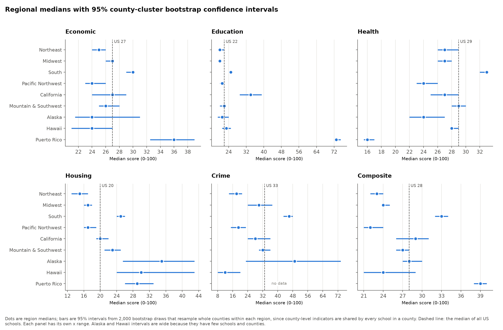

The same medians with their 95% intervals show which differences are solid.
The South's Health, Crime, and composite intervals do not overlap any other mainland region's.
Alaska and Hawaii intervals are wide, and Alaska's Crime interval spans 23 to 74.

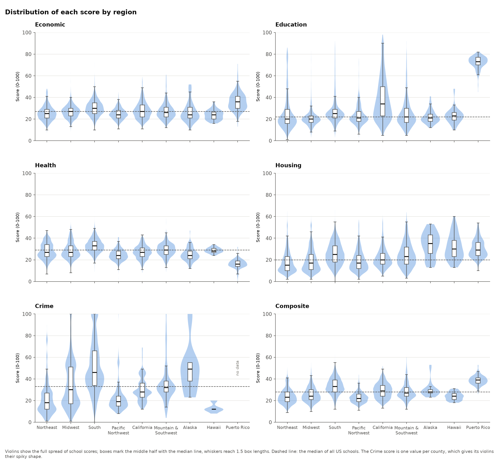

The distributions show that the regions overlap far more than they differ: for Economic, Education, Health, and Housing, the middle half of the schools in almost every mainland region includes the national median.
Crime is the exception, with the Northeast and Pacific Northwest boxes entirely below it and the South's entirely above.
California's Education distribution is the widest by far, running from under 10 to over 80.
The Crime score is one value per county, so its violins are lumpy, and the South's spans almost the full 0-100 range.

### Where the variation lives

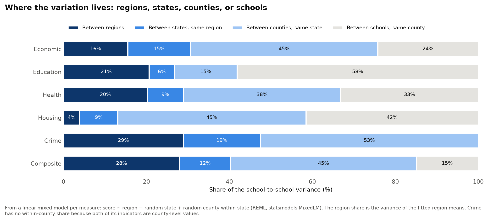

A linear mixed model per score (region as a fixed effect, random intercepts for states and for counties within states) splits the school-to-school variance into four levels:

| Score | Between regions | Between states, same region | Between counties, same state | Between schools, same county |
| --- | ---: | ---: | ---: | ---: |
| Economic | 16% | 15% | 45% | 24% |
| Education | 21% | 6% | 15% | 58% |
| Health | 20% | 9% | 38% | 33% |
| Housing | 4% | 9% | 45% | 42% |
| Crime | 29% | 19% | 53% | 0% |
| Composite | 28% | 12% | 45% | 15% |

- **Region matters, but it is not most of the story.**
  Region explains 28% of the composite's variance, more than the states within a region (12%), but the largest share (45%) lies between counties of the same state.
- **Housing barely varies by region (4%)**: housing stress is a local, county-and-neighborhood matter.
- **Education varies most within counties (58%)**, because its indicators are tract-level census values that differ from one attendance area to the next.
- **Crime has no within-county variation at all**, because both of its indicators (`Violent crime rate`, `Incarceration rate`) are county-level values.
  The same holds for `Unemployment`, `Single-parent households`, `Infant mortality rate`, and `Low birth weight`.

A plain nested sum-of-squares split gives the same ordering, with somewhat smaller region shares (composite 25%, Economic 8%); both are in [`03-regional-variation/variance_decomposition.csv`](03-regional-variation/variance_decomposition.csv).

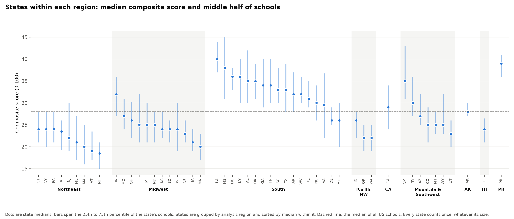

Within each region, states still differ a lot.
The South runs from Maryland (26) to Louisiana (40), the Midwest from Minnesota (20) to Indiana (32), and the Mountain & Southwest from Utah (23) to New Mexico (35).
New Mexico sits closer to the South than to its own region.
Every state counts once in this chart, unlike the school-weighted region medians.

### The same pair, different answers

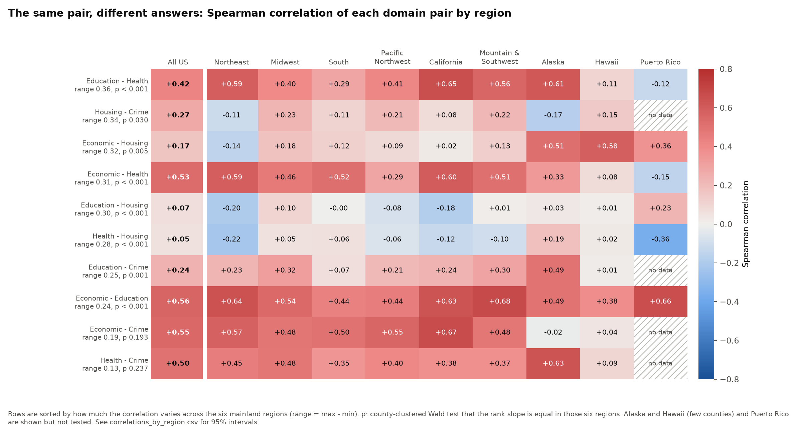

For each of the 10 pairs of domains, this is the Spearman correlation in each region.
The p-value tests whether the pair's rank slope is the same across the six mainland regions (a county-clustered Wald test of region-by-score interactions, 5 degrees of freedom); 8 of 10 pairs differ by region at p < 0.05.

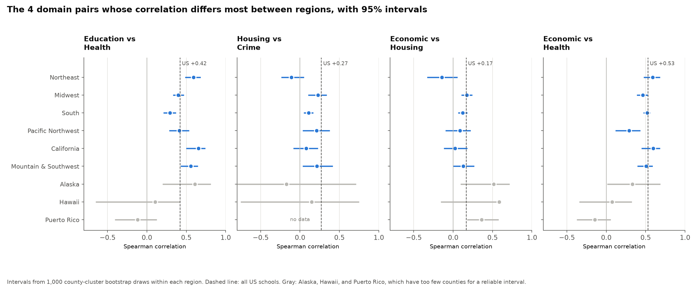

- **Education and Health**: +0.29 [0.21, 0.37] in the South but +0.65 [0.50, 0.74] in California and +0.59 [0.48, 0.68] in the Northeast (p < 0.001).
  In the South, health stress is high whether or not education stress is; elsewhere the two go together.
- **Economic and Housing**: slightly negative in the Northeast (-0.14 [-0.33, +0.05]), positive in the Midwest (+0.18 [0.10, 0.24]) (p = 0.005).
  National figures (+0.17) hide that in the Northeast the economically stressed areas are not the ones with the most housing stress.
- **Economic and Health**: +0.60 in California and +0.59 in the Northeast, only +0.29 [0.12, 0.43] in the Pacific Northwest (p < 0.001).
- **Housing and Crime**: -0.11 in the Northeast against +0.21 to +0.23 in the Midwest, Pacific Northwest, and Mountain & Southwest (p = 0.03).
- **Economic and Crime, and Health and Crime, are the stable pairs**: +0.48 to +0.67 and +0.35 to +0.48 in every mainland region (p = 0.19 and 0.24).

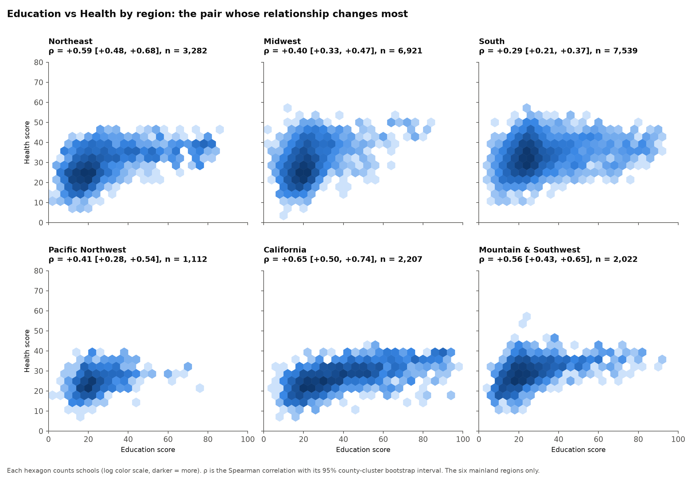

The scatter plots show the Education-Health contrast directly: California's cloud rises steadily with education stress, while the South's is a broad, flat band.

The correlations with 95% intervals are in [`03-regional-variation/correlations_by_region.csv`](03-regional-variation/correlations_by_region.csv), and the tests in [`03-regional-variation/correlation_heterogeneity.csv`](03-regional-variation/correlation_heterogeneity.csv).

### Large cities against the rest

The dataset has no urban-rural code, but it has a usable marker: ODIS takes `Lead exposure risk` and `Park access` from the City Health Dashboard, which covers only large cities, so a school has either value only when its area lies in one.
This marks 48% of schools outside Connecticut as large-city, from 35% in the Midwest to 76% in California.
Connecticut is excluded, since its two columns were filled statewide.

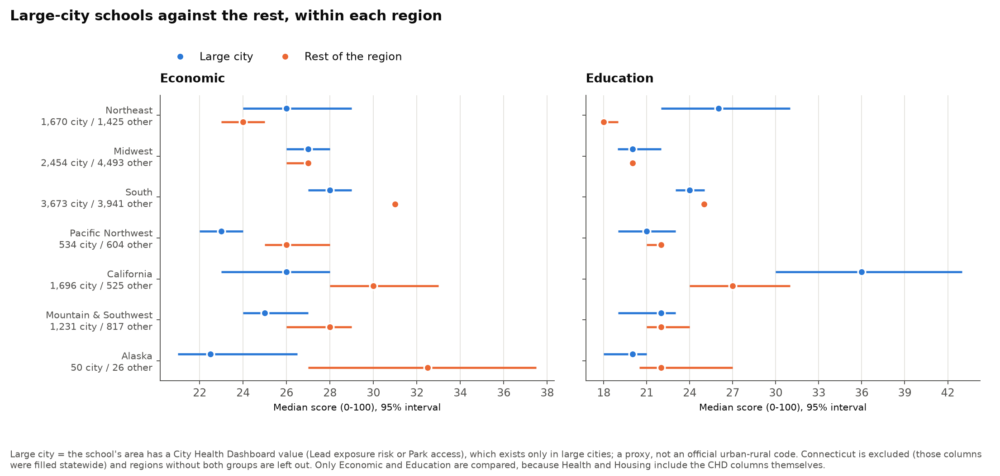

- **In the South and the West, large-city schools are less economically stressed than the rest of their region**: South 28 against 31, California 26 against 30, Mountain & Southwest 25 against 28, Pacific Northwest 23 against 26.
- **In the Northeast it is the reverse**: large-city schools score higher on Economic (26 against 24) and much higher on Education (26 against 18).
- **In the Midwest there is no gap** on either score (27 and 20 for both groups).
- **California's large-city schools have by far the highest Education stress** (36 against 27 for the rest of the state).

Only Economic and Education are compared, because the Health and Housing scores include the City Health Dashboard columns themselves, so a large-city school's score has more inputs than a rural school's.

### What drives stress in each region

The question here is, within each region, which domains and indicators matter most for how stressed its communities are overall.

**The circularity trap, and how this avoids it.**
The composite is the plain average of a school's domain scores (it matches the recomputed average within 0.8 points, the rounding of the inputs).
So a domain correlates with the composite partly because it is a fifth of it, and a plain "domain vs composite" ranking would be rigged.
Two measures avoid that:

- **Leave-one-out association:** the Spearman correlation between a domain and the average of the *other* four domains, and between an indicator and the average of the four domains it does *not* feed.
  It asks: where this is high, is the rest of the community's stress high too?
  Nothing is correlated with itself.
- **Share of the composite's variance:** within each region, the variance of the composite splits exactly into one term per domain, `Cov(w * domain, composite) / Var(composite)`, where `w` is the domain's weight in each school's composite.
  The shares sum to 100% and say which domain the differences in overall stress between the region's communities come from.
  A domain whose scores are spread out, such as the county-level Crime score, gets a large share even if it tracks the other domains only loosely, so the two measures answer different questions and are shown side by side.

**How to read the numbers.**
With thousands of schools almost every association is "significant": 94 of the 132 region-by-measure associations pass a Benjamini-Hochberg correction at q < 0.05.
So the charts lead with the size of ρ (0.1 weak, 0.3 moderate, 0.5 strong), and mark with * the 44 whose 95% interval lies entirely beyond ±0.3, a moderate effect even at its low end.
Intervals are 1,000-draw county-cluster bootstraps, p-values are bootstrap p-values, and n is the number of schools with both values.
Hawaii gets no driver ranking: its 4 counties give its county-level indicators only 4 distinct values, which a county bootstrap cannot work with.


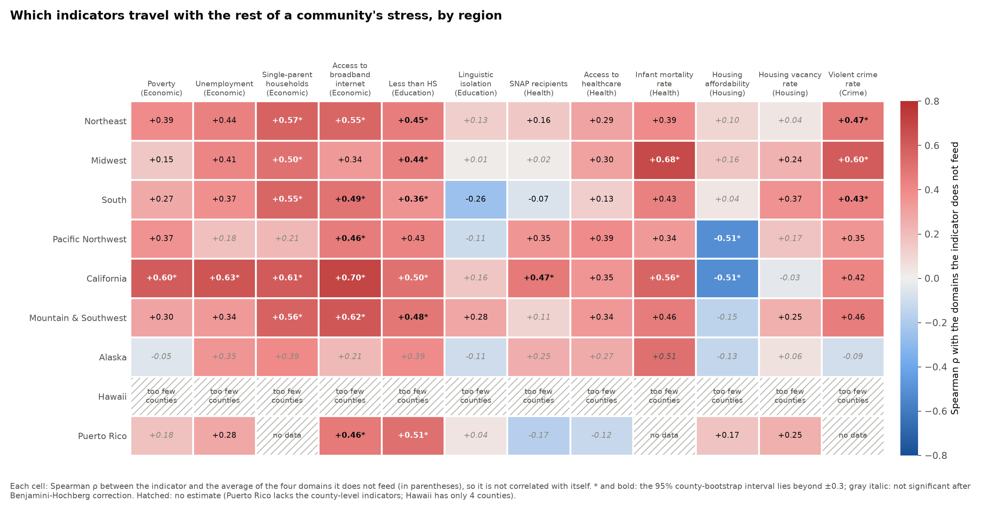

**Two indicators do not measure what their names suggest.**
The ODIS `SNAP recipients` column is the share of SNAP-receiving households that have children, not the share of households on SNAP, and `Poverty` is the share of people in poverty who are aged 6-17, not the child poverty rate.
[`../data/README.md`](../data/README.md#connecticut-fill) reproduces both from Census tables and matches ODIS for 98.5% or more of schools.
Both describe who is poor or on SNAP rather than how many are, so neither is a good food-insecurity or poverty proxy.
Their weak associations in the Midwest and the South (SNAP +0.02 and -0.07, Poverty +0.15 and +0.27) should be read that way.
`Single-parent households` and `Access to broadband internet` are the economic indicators that track overall stress most consistently.

#### Where the regions differ

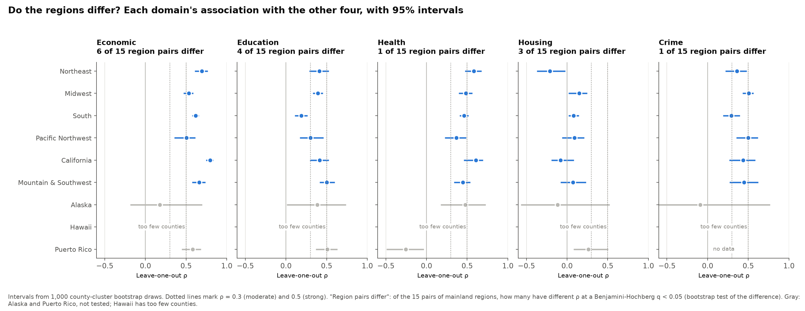

Each pair of mainland regions is tested for a difference in each association (a bootstrap test of the difference, Benjamini-Hochberg across all 255 tests); 72 differ.
The clearest differences:

- **Housing affordability runs the opposite way in the West.**
  In the Pacific Northwest and California it is strongly *negative* (ρ = -0.51 in both), while in the Northeast, Midwest, and South it is near zero (+0.04 to +0.16); each of those six differences is 0.54-0.67 and significant.
  Housing cost burden there sits in communities that are otherwise less stressed.
- **In California, economic stress is almost the whole story** (Economic ρ = +0.80 [0.74, 0.84]), higher than in the Midwest (+0.54), South (+0.62), Pacific Northwest (+0.51), and Mountain & Southwest (+0.66), all significant.
- **In the South, education stress is only loosely tied to the rest** (ρ = +0.19 [0.11, 0.26]), significantly weaker than in the Northeast, Midwest, California, and Mountain & Southwest (+0.39 to +0.50).
- **SNAP recipients (as ODIS measures it) goes with other stress in California (+0.47) and the Pacific Northwest (+0.35), not in the South (-0.07) or the Midwest (+0.02).**
- **Infant mortality tracks the rest of stress most in the Midwest** (+0.68 [0.58, 0.75]), more than in the Northeast (+0.39), South (+0.43), or Pacific Northwest (+0.34).

The full tables are [`drivers_by_region.csv`](03-regional-variation/drivers_by_region.csv), [`composite_variance_shares.csv`](03-regional-variation/composite_variance_shares.csv), and [`driver_region_differences.csv`](03-regional-variation/driver_region_differences.csv).

#### Region by region

All of this is correlation within the region, not cause and effect: an indicator that tracks the rest of stress may be a symptom, a cause, or a marker of something else.
ODIS describes the neighborhoods around high schools, not the students or families in them.
"Where a lawmaker would look first" means where the numbers point, not what policy would work.

**Northeast** (3,303 schools, composite 23, the second-lowest).
*What to focus on:* stress here is concentrated in economically stressed communities, which carry the other kinds too (Economic ρ = +0.69 [0.61, 0.77], the second-strongest of any region).
Housing is the odd one out: housing stress is slightly *lower* where other stress is high (ρ = -0.21 [-0.37, -0.02]), and it explains only 2% of the composite's variance.
*Where a lawmaker would look first:* the economic indicators that travel with everything else, single-parent households (ρ = +0.57) and broadband access (+0.55), and education, which accounts for the largest share of how much communities differ (38% [27, 47]).
Large-city schools carry most of that education stress (median 26, against 18 elsewhere in the region).

**Midwest** (6,947 schools, composite 24).
*What to focus on:* the strongest single signal is county-level health and safety: infant mortality (ρ = +0.68 [0.58, 0.75]) and violent crime (+0.60 [0.52, 0.66]) track the rest of community stress more closely than anything else.
Crime accounts for over half of the variation in the composite (53% [49, 56]).
*Where a lawmaker would look first:* counties with high infant mortality and violent crime.
Caveat: both are county-level values and missing for 36-44% of Midwest schools, mostly rural, so this describes the counties that report them.

**South** (7,614 schools, composite 33, the highest of the mainland regions).
*What to focus on:* the South is more stressed on every domain, and crime both scores highest (median 46) and accounts for half of how much its communities differ (51% [47, 55]).
Among the other domains, economic stress is the one that travels with the rest (ρ = +0.62 [0.58, 0.66]), led by single-parent households (+0.55) and broadband access (+0.49).
*Where a lawmaker would look first:* county crime levels, and economic conditions, especially family structure and broadband.
Education stress here is only weakly tied to the rest (ρ = +0.19), so it is a separate problem rather than part of one bundle; linguistic isolation even runs opposite (-0.26).

**Pacific Northwest** (1,138 schools, composite 22, the lowest).
*What to focus on:* economic stress (ρ = +0.51 [0.35, 0.62]) and crime (+0.50 [0.35, 0.62]) go with the rest of community stress, and housing affordability runs opposite (ρ = -0.51 [-0.60, -0.39]): the least affordable places are the otherwise least stressed.
*Where a lawmaker would look first:* housing cost burden, as its own issue, because targeting by the composite score would miss it; and broadband access (ρ = +0.46), the indicator most tied to wider stress.
The region has 117 counties, so intervals are wider than for the larger regions.

**California** (2,221 schools, composite 29).
*What to focus on:* stress comes bundled: economically stressed communities are stressed on nearly everything (Economic ρ = +0.80 [0.74, 0.84], the strongest of any region), with broadband (+0.70), unemployment (+0.63), and poverty (+0.60) all strong.
Education accounts for the largest share of how much communities differ (45% [33, 56]), and large-city schools have the highest education stress (median 36, against 27 elsewhere in the state).
*Where a lawmaker would look first:* economic indicators are a good single targeting signal here, and education stress, driven by linguistic isolation and adults without a high school diploma, is where communities differ most.
Housing affordability runs opposite (ρ = -0.51), as in the Pacific Northwest.
California's 58 counties are large, so its 2,221 schools carry the information of about 17 independent ones (see Methods).

**Mountain & Southwest** (2,048 schools, composite 27, the national average).
*What to focus on:* economic stress leads (ρ = +0.66 [0.57, 0.74]), with broadband access (+0.62 [0.55, 0.69]) the strongest single indicator, and education is more tightly tied to the rest here than anywhere else on the mainland (+0.50 [0.42, 0.60]).
*Where a lawmaker would look first:* broadband access and single-parent households (+0.56), and crime, which accounts for the largest share of how much communities differ (39% [31, 45]).
New Mexico (composite 35) is far more stressed than the rest of the region (Utah 23).

**Alaska** (76 schools, 23 counties).
*What to focus on:* the level, not the drivers: Alaska's housing stress is the highest of any region (median 35, delta +0.55).
Only one association survives the correction (Health, ρ = +0.48 [0.17, 0.73]); the rest are too uncertain to rank.
*Where a lawmaker would look first:* housing conditions; anything more specific needs data with more schools and counties.

**Hawaii** (43 schools, 4 counties).
No driver ranking is possible (see above).
The level stands out on housing (median 30, delta +0.46) and crime is the lowest of any region (12), but Hawaii has no incarceration data, so its Crime score is violent crime alone.

**Puerto Rico** (205 schools, composite 39, the highest).
*What to focus on:* economic stress drives the differences between communities (43% [37, 51] of the composite's variance; ρ = +0.58 [0.45, 0.68]), together with education (ρ = +0.51), where adults without a high school diploma (ρ = +0.51) and broadband access (+0.46) stand out.
*Where a lawmaker would look first:* economic conditions and adult education.
Puerto Rico's Health score rests on 2 of its 5 indicators and has no Crime score, so its low Health score and its negative Health association (ρ = -0.25) say more about missing data than about health.

### Missing data by region

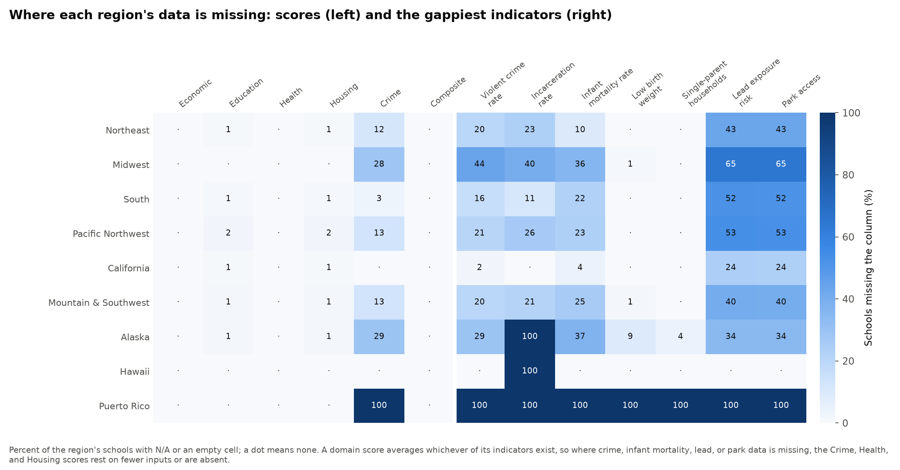

- **Puerto Rico has no Crime score and none of the county-level health indicators, single-parent households, lead, or park data**, so its Economic, Health, and Housing scores rest on fewer inputs than elsewhere.
- **The Midwest is missing Crime for 28% of its schools** (violent crime 44%, incarceration 40%), mostly in the rural Plains, so its Crime median describes its more urban counties.
- **Alaska and Hawaii have no incarceration data**, so their Crime score is violent crime alone.
- **Connecticut has no Crime score** (12% of the Northeast).
- `Lead exposure risk` and `Park access` are missing for 24% (California) to 65% (Midwest) of schools, which is what makes them usable as the large-city marker.

The composite averages whichever domains exist, so a school with no Crime score gets a four-domain composite.
Crime is the highest-scoring domain nationally (median 33, against 20-29 for the others), so a four-domain composite tends to be lower; this affects the Midwest (28% without Crime) and Connecticut most.

### Methods, and why

- **County clustering.**
  Six indicators, and the whole Crime score, are one value per county, and neighboring attendance areas share census tracts, so schools in one county are not independent.
  Every interval is a stratified cluster bootstrap: 2,000 draws (1,000 for correlations) that resample whole counties within each region, with a fixed seed.
  The effective sample size in the table above divides the school count by the design effect `1 + (m - 1) x ICC`, where `m` is the school-weighted mean number of schools per county and the ICC comes from the mixed model (0.79 for the composite).
  California's 2,221 schools behave like about 17 independent observations, because they sit in 58 large counties.
- **Unequal region sizes.**
  Medians and effect sizes are computed within each region, so the South's size does not affect the Pacific Northwest's estimate, and the state chart weights every state equally.
  Cliff's delta compares each region with all other schools, so the comparison group is dominated by the South and the Midwest.
- **Effect sizes, not just p-values.**
  With 23,595 schools almost any difference is "significant", so the charts report medians, Cliff's delta, and variance shares, each with an interval.
  p-values appear only for the correlation-heterogeneity tests, where they are county-clustered.
- **Mixed model.**
  `score ~ region + (1 | state) + (1 | county within state)`, fit by REML with statsmodels `MixedLM`.
  The region share is the variance of the fitted region means across schools.
  For Crime, which has no within-county variance, the county term is dropped and the residual is the between-county variance.
- **Drivers.**
  Leave-one-out Spearman correlations and exact composite-variance shares, each with 1,000-draw county-cluster bootstrap intervals and percentile-bootstrap p-values, Benjamini-Hochberg corrected across the 132 associations and, separately, across the 255 pairwise region comparisons.
  Regions with fewer than 20 counties (Hawaii) are left out; Alaska and Puerto Rico are estimated but not in the pairwise tests.
- **Correlation tests.**
  Both scores are turned into national ranks scaled to unit variance, and `y ~ region * x` is fit by least squares with county-clustered standard errors; the test is that all region-by-slope interactions are zero.

### Caveats

- The regions are a choice.
  Moving Idaho into the Pacific Northwest, or New Mexico into the Southwest, is a judgment call, and the state chart shows that states within a region can differ as much as regions do.
- The scores measure the neighborhood around a school, not the school, and ODIS scales each indicator nationally, so "less stress" is relative to other US high schools.
- County-level indicators blur differences inside large counties.
  That caps how much a school can differ from its county neighbors on Economic, Health, and Crime, and it is part of why California has so few effective observations.
- The large-city marker is a proxy: it reflects City Health Dashboard coverage, not population density, and schools without a School Attendance Boundary take it from the census tracts of their ZIP code.
- Alaska, Hawaii, and Puerto Rico estimates rest on 4 to 77 counties; read them as indicative.
- Puerto Rico's and Connecticut's gaps (above) mean their Health and composite scores are not fully comparable with other regions.

### Tables

| File | Contents |
| --- | --- |
| [`regions.csv`](03-regional-variation/regions.csv) | Each state's Census region, Census division, analysis region, schools, and counties |
| [`region_summary.csv`](03-regional-variation/region_summary.csv) | Per region and score: schools, share missing, counties, states, median and 95% CI, Cliff's delta and 95% CI, mean share of the domain's indicators present, design effect, and effective n |
| [`variance_decomposition.csv`](03-regional-variation/variance_decomposition.csv) | Per score: the mixed-model variance shares, county ICC, and the plain sum-of-squares shares |
| [`correlations_by_region.csv`](03-regional-variation/correlations_by_region.csv) | Spearman correlation of each domain pair in each region, with schools and 95% CI |
| [`correlation_heterogeneity.csv`](03-regional-variation/correlation_heterogeneity.csv) | Per pair: the national correlation, the mainland range, and the clustered Wald test |
| [`state_composite.csv`](03-regional-variation/state_composite.csv) | Per state: region, schools, composite median, and quartiles |
| [`large_city_contrast.csv`](03-regional-variation/large_city_contrast.csv) | Per region, group, and score: schools, counties, median, and 95% CI |
| [`drivers_by_region.csv`](03-regional-variation/drivers_by_region.csv) | Per region and domain or indicator: schools, counties, leave-one-out Spearman ρ and 95% CI, p, BH q, size label, whether the CI clears 0.1 and 0.3, and rank in the region |
| [`composite_variance_shares.csv`](03-regional-variation/composite_variance_shares.csv) | Per region and domain: share of the composite's variance with 95% CI, share of schools with the domain, and rank |
| [`driver_region_differences.csv`](03-regional-variation/driver_region_differences.csv) | Per measure and pair of mainland regions: both ρ, their difference with 95% CI, p, and BH q |

## 04 - National relationships

How the ODIS measures relate to each other across the whole country: which kinds of neighborhood stress go together, how many separate dimensions there are, and what goes with low adult educational attainment around a school.
How these relationships differ between regions is the subject of section 03.
All numbers come from `data/index_scores_v3_2026_ct_filled.csv` (23,595 schools in 3,167 counties).

### Before reading the numbers

- **Every measure points the same way.** The domain scores and the indicators are all scaled 0-100 so that higher means more community stress.
  For example, a high `Access to broadband internet` value means *less* broadband, and a high `2-year college or higher` value means *fewer* adults with a degree.
  The indicators are scaled scores, not raw percentages.
  The `Gini index` is the one raw measure (income inequality, 0-1), and it does not enter the index.
- **Eight measures are county-level.** `Unemployment`, `Single-parent households`, `Infant mortality rate`, `Low birth weight`, `Violent crime rate`, `Incarceration rate`, the `Gini index`, and so the `Crime` domain take one value per county, shared by every school in it (marked `*` in the charts).
  Treating those schools as independent would overstate the evidence, so every interval below is either clustered by county or computed on county means.
- **Missing values are left missing.** Nothing is imputed.
  Each correlation uses the schools that have both measures, and each model or component analysis uses the schools that have all of its measures; every chart and table states its n.
  `Lead exposure risk` and `Park access` exist for only about half the schools, mostly in cities, and the crime and infant-mortality indicators for about three quarters, mostly outside rural counties.
- **The scores are built from each other.** A domain score is the equal-weight average of the indicators a school has (`Linguistic isolation` counts double in `Education`), and the `Composite Score` is the equal-weight average of the domains a school has.
  We checked this by regressing each score on its inputs (R² above 0.99 in every case).
  So a domain correlates with its own indicators, and the composite with its domains, partly by construction; see [Circularity](#circularity-what-is-built-in) below.
- **Race and ethnicity are not used.** Those columns are context only and are not part of the index, so they stay out of this analysis.

### Correlations between all measures


Spearman rank correlations between all 27 measures, with rows and columns grouped by how similar their correlations are.
n per pair ranges from 10,329 (pairs involving `Lead exposure risk` or `Park access`) to 23,595.
Outlined cells are pairs related by construction.
Most correlations (291 of 351) are positive: stresses tend to co-occur.
The clustering shows three families:

- **Education and connectivity:** the attainment shares, `Access to broadband internet`, `Poverty`, and the `Economic` and `Education` domains.
- **Family, health, and crime (all county-level):** `Single-parent households`, `Low birth weight`, `Infant mortality rate`, `Violent crime rate`, and the `Crime` domain.
- **Urban cost and language:** `Housing affordability`, `Linguistic isolation`, the `Gini index`, and the share with only a 2-year degree.

The third family runs *against* the rural stresses: `Housing affordability` correlates negatively with `Infant mortality rate` (ρ = -0.45), `Incarceration rate` (-0.37), and missing broadband (-0.35), and `Park access` (lack of parks) with `Lead exposure risk` (-0.53).
Expensive, crowded, immigrant neighborhoods and remote, depopulating ones are stressed in different ways.

### What is a meaningful p for a Spearman coefficient?

With this many schools, p alone is not meaningful: at n = 23,595 any |ρ| above 0.013 has p < 0.05, and 345 of the 351 pairs in the heatmap pass a Benjamini-Hochberg correction if every school is treated as independent.
Instead, a pair has to clear two separate bars:

1. **Statistically reliable:** Benjamini-Hochberg q < 0.05 across all 351 pairs, with p taken from a county-cluster bootstrap (200 resamples of whole counties) rather than from the naive formula, *and* a 95% cluster-bootstrap interval that excludes 0.
   The clustered intervals are typically about four times as wide as the naive ones, and about five times for pairs with a county-level measure, because schools in the same county resemble each other.
   321 of 351 pairs are reliable; the 24 pairs that are naive-significant but not reliable all have |ρ| < 0.1.
2. **Practically meaningful:** an effect size of at least moderate.

| Band | \|ρ\| | Pairs | Reliable |
| --- | --- | ---: | ---: |
| Negligible | < 0.1 | 60 | 30 |
| Weak | 0.1-0.3 | 130 | 130 |
| Moderate | 0.3-0.5 | 98 | 98 |
| Strong | ≥ 0.5 | 63 | 63 |

Every pair of at least weak strength is reliable, so here the effect size, not the p-value, is what separates findings from noise.
For scale: the smallest |ρ| detectable with 80% power at α = 0.05 is 0.018 with 23,595 schools, 0.028 with the 10,000 or so schools that have lead and park data, and 0.050 with about 3,100 counties, the effective sample for county-level measures.
[`spearman_pairs.csv`](04-national-relationships/spearman_pairs.csv) has, for every pair, ρ with its n, the cluster-bootstrap interval, naive and clustered p with their Benjamini-Hochberg q, the effective n and minimum detectable ρ, the strength band, whether the pair is related by construction, and the between- and within-county ρ.

### Which stresses go together across domains


The "which factors go together" story rests on pairs of indicators from *different* domains, which no construction ties together.
Of the 130 such pairs (the 17 index inputs plus the `Gini index`), 112 are reliable, and 51 are reliable and at least moderate: 13 strong and 38 moderate.
The strongest:

| Pair | ρ | 95% interval | n |
| --- | ---: | --- | ---: |
| `Single-parent households` * × `Violent crime rate` * | 0.75 | 0.68 to 0.79 | 17,716 |
| `Access to broadband internet` × `2-year college or higher` | 0.69 | 0.67 to 0.72 | 23,404 |
| `Single-parent households` * × `Low birth weight` * | 0.68 | 0.63 to 0.71 | 23,287 |
| `Low birth weight` * × `Violent crime rate` * | 0.67 | 0.60 to 0.73 | 17,716 |
| `Access to broadband internet` × `Housing vacancy rate` | 0.64 | 0.60 to 0.67 | 23,404 |
| `Linguistic isolation` × `Housing affordability` | 0.59 | 0.55 to 0.62 | 23,404 |
| `Lead exposure risk` × `Park access` | -0.53 | -0.58 to -0.46 | 11,509 |

The county-level pairs (`*`) rest on counties, not schools, and describe counties.

### The five domain scores


`Economic`, `Health`, `Crime`, and `Education` go together (ρ = 0.24 to 0.56), with `Economic` the most connected.
`Housing` barely moves with anything: ρ = 0.05 with `Health`, 0.07 with `Education`, 0.17 with `Economic`, and 0.27 with the county-level `Crime`.
The `Crime` scores pile up at 100 because the scaled crime indicators are truncated at 100.


A school-level correlation mixes two things: differences between counties and differences between schools in the same county.
Splitting them shows that the Housing correlations exist only between counties: within a county, schools with more housing stress have *slightly less* of the other stresses (ρ = -0.07 to -0.02).
`Education` and `Crime` are more closely linked between counties (0.40) than across schools (0.24); crime is only measured by county, so it cannot track the finer education differences inside one.
The other domain pairs are similar at every scale, so they are not an artifact of county-level data.

### Circularity: what is built in


Each domain score correlates with the composite partly because it is one fifth of it.
Leaving the domain out of the composite shows how much is real overlap:

| Domain | ρ with composite | ρ with the other domains' average |
| --- | ---: | ---: |
| Economic | 0.74 | 0.65 |
| Health | 0.65 | 0.53 |
| Crime | 0.82 | 0.49 |
| Education | 0.63 | 0.38 |
| Housing | 0.43 | 0.18 |

`Economic` is the domain most in line with the rest of the index; `Housing` adds the most independent information.

The same check on indicators shows that three domains do not measure one thing.
With the indicator removed, `Park access` (0.92 with its own domain as published) and `Lead exposure risk` (0.74) are unrelated to the rest of their domain (-0.06 and -0.02), and `Housing vacancy rate` is *negatively* related to the rest of `Housing` (-0.38).
Where `Park access` exists, it dominates the `Housing` score, because vacancy and affordability largely cancel each other out.
So a Housing score means something different for a school with park data (about half) than for one without.
[`leave_one_out.csv`](04-national-relationships/leave_one_out.csv) has all 22 comparisons.

### How many dimensions of stress


A principal component analysis asks how many independent patterns explain the indicators.
The main run uses the 12 indicators that are missing for 2% of schools or fewer (n = 23,082 schools with all 12), after a rank transform so it follows the Spearman correlations.
Horn's parallel analysis keeps 4 components, which together explain 71% of the variance; the first explains only 29%.
Adding infant mortality and the two crime indicators (15 indicators, n = 14,657) or all 17 index inputs (n = 10,088) also gives 4 components and 70-71%.


After a varimax rotation the four dimensions are:

| Main-run component | Loads on (loading) | Plain reading |
| --- | --- | --- |
| RC1 | no degree (0.85), missing broadband (0.84), no HS diploma (0.76), vacancy (0.62), uninsured children (0.50) | Low attainment and weak connectivity, typical of rural and depopulating areas |
| RC2 | linguistic isolation (0.87), housing affordability (0.80), no HS diploma (0.44), unemployment (0.41); vacancy (-0.43) | Crowded, expensive, immigrant neighborhoods |
| RC3 | low birth weight (0.90), single-parent households (0.87) | Family and birth-health stress (county-level) |
| RC4 | SNAP recipients (0.87), child poverty (0.70) | Household poverty |

The 15-indicator run reproduces all four (Tucker congruence 0.97-0.99 with the main run), with `Infant mortality rate` and `Violent crime rate` joining the family-and-health dimension.
The 17-indicator run, which only has city-heavy schools, reproduces the first three less closely (0.82-0.93), and its fourth dimension becomes vacancy, missing broadband, and lead exposure instead of poverty.
The first unrotated component correlates 0.83 with the `Composite Score`, so the composite is close to a single "overall stress" summary, but it averages over dimensions that point in different directions.
[`pca_loadings.csv`](04-national-relationships/pca_loadings.csv) has every loading, with the matched main-run component and its congruence.

### What goes with low adult educational attainment


The outcome is the attainment half of the `Education` domain: the mean of the `Less than HS` and `2-year college or higher` scores (0-100, higher = fewer adults with a diploma or degree; SD 12.5 points).
The predictors are the 11 indicators with 2% missing or fewer that are not attainment measures, including `Linguistic isolation` (the other half of `Education`) and the `Gini index`.
Each coefficient is the change in the attainment score for a one-standard-deviation higher predictor, holding the others fixed, with 95% intervals clustered by county.
Main model: n = 23,082 schools in 3,005 counties, R² = 0.67.

| Predictor | Points per SD | 95% interval |
| --- | ---: | --- |
| `Access to broadband internet` (missing broadband) | +5.5 | 4.8 to 6.2 |
| `Linguistic isolation` | +4.8 | 4.1 to 5.5 |
| `Poverty` | +2.4 | 2.1 to 2.8 |
| `Unemployment` * | +2.3 | 1.8 to 2.8 |
| `SNAP recipients` | +1.4 | 1.0 to 1.8 |
| `Access to healthcare` (uninsured children) | +1.0 | 0.6 to 1.3 |
| `Low birth weight` * | +0.8 | 0.4 to 1.3 |
| `Housing vacancy rate` | +0.4 | 0.0 to 0.7 |
| `Single-parent households` * | +0.1 | -0.3 to 0.6 |
| `Housing affordability` | -1.2 | -1.6 to -0.7 |
| `Gini index` * | -1.6 | -2.1 to -1.0 |

Missing broadband and linguistic isolation carry the most weight, followed by poverty and unemployment.
Higher housing-cost stress and higher inequality go with *more* degrees once the rest is held fixed: those are features of expensive metropolitan areas.
These are associations across neighborhoods, not causal effects.

The extended model adds `Infant mortality rate`, `Violent crime rate`, and `Incarceration rate` (n = 14,657 schools, R² = 0.71).
It covers only the 850 counties that report all three, which leaves out most rural counties, so it is a check rather than the headline.
The main coefficients keep their size and sign except `Low birth weight`, which flips to -1.0 (-1.8 to -0.2): with infant mortality and violent crime in the model, the three county-level health and crime measures are too correlated to separate.
Of the new predictors, `Incarceration rate` (+1.0, 0.6 to 1.4) and `Infant mortality rate` (+0.8, 0.1 to 1.6) are nonzero and `Violent crime rate` is not.

**Multicollinearity** is low: the largest variance inflation factor is 2.6 in the main model (`Single-parent households`) and 4.1 in the extended one, and the condition numbers of the standardized predictors are 3.3 and 5.0.
Clustering by state instead of county widens the intervals, but only `Housing vacancy rate` would lose significance.


Variance explained is measured on counties the model never saw (5-fold cross-validation with whole counties held out):

- The linear model explains 65% (±2%) of attainment differences; a cross-validated ridge regression gives the same, as expected with few, weakly correlated predictors.
- A gradient-boosting model explains 77% (±2%), so part of the relationship is nonlinear or depends on combinations of predictors.
- On county means (one row per county, n = 3,005), the linear model explains 65%, so the school-level result is not driven by repeating county values.
- The four economic indicators alone explain 53%; they also carry the largest unique share (21 points lost when only they are dropped), followed by `Linguistic isolation` (8 points).
  Health adds 2 points beyond the rest, housing and inequality about 1 or less, and in the extended model crime adds nothing (0.2 points) once economics is known.

[`attainment_model_coefficients.csv`](04-national-relationships/attainment_model_coefficients.csv) has every coefficient for the main model, the extended model, and the county-means model, with county-clustered, state-clustered, and naive standard errors and the variance inflation factors.
[`attainment_model_cv.csv`](04-national-relationships/attainment_model_cv.csv) has the cross-validated R² for every model and predictor group.

### Caveats

- Everything here is correlational and cross-sectional, and describes neighborhoods, not individual students or families.
- The indicators are ODIS's scaled 0-100 scores, some truncated at 0 or 100, so effects are in scaled points, not percentages.
- County-level measures carry one value per county; conclusions about them are conclusions about counties.
- The samples differ by analysis because missingness is not random: lead and park data are city-heavy, and crime and infant-mortality data are thin in rural counties.
- Connecticut's filled values for `Lead exposure risk` and `Park access` are approximations (see [`../data/README.md`](../data/README.md#connecticut-fill)); they are 208 of 23,595 rows.
- Domain and composite scores average whatever components a school has, so the same score can mix different ingredients for different schools.

### National headline findings

1. **Community stress is not one thing.** Four separate dimensions explain 71% of the variation in the indicators, and the biggest explains only 29%: low attainment with weak connectivity, expensive immigrant neighborhoods, family and birth-health stress, and household poverty.
2. **The digital divide tracks the education divide.** Missing broadband is the strongest correlate of low adult attainment (ρ = 0.69) and its strongest predictor with everything else held fixed (+5.5 points per SD); non-education indicators explain 65% of attainment differences in counties the model never saw.
3. **Housing stress stands apart.** The Housing domain correlates 0.05 to 0.27 with the other domains, is flat or slightly negative within counties, and only 0.18 with the rest of the composite; its own indicators pull in opposite directions.
4. **Family structure, birth health, and violent crime move together at the county level** (ρ = 0.67 to 0.75), the tightest cross-domain cluster in the data.
5. **With 23,595 schools, significance is cheap.** Any |ρ| above 0.013 is "significant"; 321 of 351 pairs survive a county-clustered, multiple-testing-corrected test, so effect size is what matters: 51 of 130 cross-domain indicator pairs are both reliable and at least moderate.

## 05 - Regional weights

The ODIS composite is the same formula everywhere: the equal-weight average of the five domains.
But a given kind of community stress need not matter equally everywhere.
This analysis asks whether it does, using one outcome: the federal four-year high school graduation rate.
It fits, region by region, how much each domain score predicts a school's graduation rate, turns those effects into regional domain weights, and scores every school with its region's weights next to the ODIS composite.

The graduation rates are joined onto a copy of `data/index_scores_v3_2026_ct_filled.csv` in memory; no existing file changes.
The joined and derived tables are new files in `data/derived/`, described in [`../data/README.md`](../data/README.md#derived-graduation-rates-and-regional-weights).

### The graduation rates

The source is the U.S. Department of Education's school-level four-year adjusted cohort graduation rate (ACGR) for school year 2022-23, all students, from ED Data Express.
That is the same school year as the NCES directory the ODIS school IDs match, and it falls inside the ODIS census window (ACS 2019-2023).
The file has 23,911 schools, joined on the 12-digit `NCESSCH` ID.

To protect privacy, ED reports a school's rate more coarsely the smaller its cohort, and every row keeps its exact cohort size.
The tiers below are what the file shows (2,056 schools with cohorts of 61-300 also have an exact rate):

| Cohort | How the rate is reported | Example |
| ---: | --- | --- |
| 1-5 | Suppressed | `S` |
| 6-15 | 50-point bin | `>=50%`, `<50%` |
| 16-30 | 20-point range or bound | `60-79%`, `>=80%` |
| 31-60 | 10-point range or bound | `80-89%`, `>=90%` |
| 61-300 | 5-point range or bound, some exact | `90-94%`, `>=95%` |
| 301+ | Exact percentage, or a bound at the extremes | `92%`, `>=99%` |

**Parsing rule.** A range counts both end points (`90-94%` is 90 to 94), `>=X%` means X to 100, `<=X%` means 0 to X, and `<X%` means 0 to X-1; the rate used is the midpoint (92, 97.5, 2.5, and 24.5 in those examples).
Rates reported exactly or within at most 20 points (cohorts of 16 or more) are **usable**.
The 50-point bins say almost nothing about a school, and suppressed rates nothing, so both are left out; the sensitivity check below adds the 50-point bins back.

### Coverage

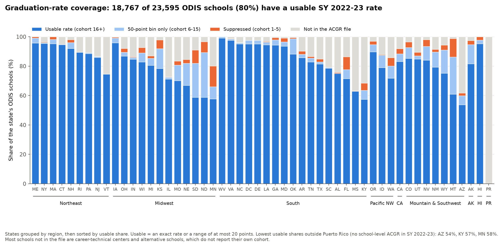

| ODIS schools | Count | Share |
| --- | ---: | ---: |
| Usable rate (cohort 16+) | 18,767 | 79.5% |
| 50-point bin only (cohort 6-15) | 1,128 | 4.8% |
| Suppressed (cohort 1-5) | 679 | 2.9% |
| Not in the ACGR file | 3,021 | 12.8% |

Of the usable rates, 6,217 are exact, 7,436 are ranges of at most 5 points, 3,323 of 6-10 points, and 1,791 of 11-20 points.
Puerto Rico's 205 schools have no school-level rate for 2022-23.
Outside it, coverage is lowest in Arizona (54% usable), Kentucky (57%), Minnesota (58%), and North and South Dakota (59% each); every other state is above 60%, and most are above 80%.

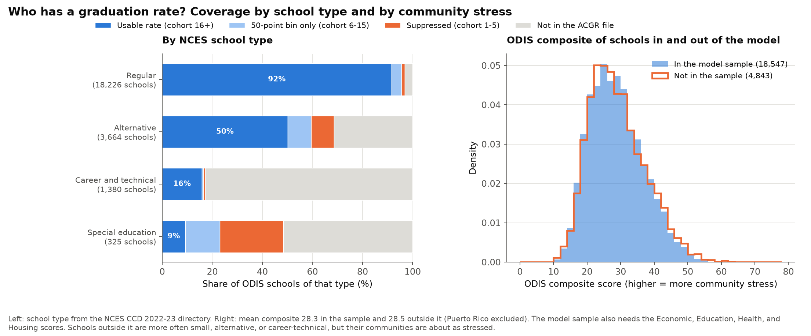

Coverage is biased by school type, not by community stress:

- **Small and non-traditional schools drop out.** 92% of regular high schools have a usable rate, against 50% of alternative schools, 16% of career and technical schools, and 9% of special education schools (school type from the NCES CCD 2022-23 directory).
  Three quarters of the schools with no ACGR row (2,292 of 3,021) are alternative or career and technical schools, most of which do not report a cohort of their own because their students graduate from a home school.
- **Their communities are about as stressed.** The ODIS composite averages 28.3 for the 18,547 schools in the model sample and 28.5 for the 4,843 outside it (Puerto Rico excluded), and the two distributions nearly coincide.

So the results describe regular, mid-size and larger high schools best.
[`coverage_by_state.csv`](05-regional-weights/coverage_by_state.csv), [`coverage_by_region.csv`](05-regional-weights/coverage_by_region.csv), and [`coverage_by_school_type.csv`](05-regional-weights/coverage_by_school_type.csv) have the counts.

### Regions and models

**Regions.** The same analysis regions as [section 03](#03---regional-variation), from `analysis/03_regional_variation.py`: **Northeast**, **Midwest**, **South** (with DC), **Pacific Northwest** (WA, OR, ID), **California**, and **Mountain & Southwest** (AZ, CO, MT, NV, NM, UT, WY).
Each of these six gets its own model and weights.
Section 03 also keeps **Alaska**, **Hawaii**, and **Puerto Rico** as their own small groups.
Alaska (42 schools in the model) and Hawaii (41) are too small for a model of their own, so they are scored with the weights of one **national model**: the same regression over all 16,457 schools with a usable rate and all five domains, with one set of slopes.
**Puerto Rico** is not scored: it has no school-level graduation rates for 2022-23, and its `Health` score lacks most of its indicators, so the Health-heavy weights would rank it on almost nothing.

**Model.** For each region, an OLS regression of the graduation rate (percentage points) on the five domain scores, with:

- **State fixed effects**, so schools are compared only with schools in the same state.
  States define and certify graduation differently, so raw rates are not comparable across state lines.
- **Domains standardized nationally** (mean 0, SD 1 over all 23,595 schools), so a slope is "percentage points of graduation per national SD of that domain" and slopes compare across regions.
- **Standard errors clustered by county**, since the county-level indicators give every school in a county the same values.

All six regions are fit at once with region-specific slopes, which gives the same slopes as separate regressions and lets the slopes be tested against each other.

**Crime.** The `Crime` score is missing for 3,219 schools, all of Connecticut and much of the rural Plains and Mountain states.
Rather than silently drop them, every model runs twice: with all five domains (16,374 schools with `Crime`), and with the four other domains (18,547 schools).

**Multicollinearity.** The domains overlap (`Economic` correlates 0.59 with `Health` and 0.52 with `Crime` in the sample), but every variance inflation factor is at most 3.0 ([`vif.csv`](05-regional-weights/vif.csv)), well below the usual concern threshold of 5-10.
Each slope still means "holding the other domains fixed", so a domain that shares much with another can show a small slope of its own.

### Per-region domain effects


| Region | Economic | Education | Health | Housing | Crime | Schools | Within-state R² |
| --- | ---: | ---: | ---: | ---: | ---: | ---: | ---: |
| Northeast | -1.1 (-2.3, 0.1) | **-1.8** (-3.2, -0.5) | **-1.3** (-2.0, -0.6) | 0.2 (-0.5, 0.8) | -1.1 (-2.3, 0.2) | 2,676 | 0.09 |
| Midwest | **-1.3** (-2.5, -0.1) | -1.6 (-3.5, 0.2) | **-4.7** (-5.5, -3.8) | 0.2 (-0.4, 0.8) | 0.4 (-0.2, 1.1) | 3,804 | 0.10 |
| South | 0.3 (-0.3, 0.9) | **-1.4** (-2.6, -0.2) | **-3.4** (-4.2, -2.7) | 0.4 (-0.0, 0.9) | 0.2 (-0.3, 0.7) | 6,034 | 0.05 |
| Pacific Northwest | -1.7 (-4.8, 1.4) | -4.4 (-9.4, 0.6) | -0.9 (-5.7, 3.9) | **+3.0** (0.9, 5.2) | 1.6 (-1.5, 4.6) | 761 | 0.03 |
| California | 0.2 (-1.8, 2.1) | -0.6 (-1.3, 0.2) | -1.6 (-3.4, 0.1) | 0.4 (-0.7, 1.6) | 0.6 (-2.3, 3.6) | 1,840 | 0.01 |
| Mountain & Southwest | **+2.5** (0.1, 5.0) | **-3.1** (-5.6, -0.6) | **-7.4** (-10.6, -4.2) | **+3.2** (2.1, 4.4) | 0.1 (-1.7, 2.0) | 1,259 | 0.09 |
| National model | -0.1 (-0.6, 0.5) | **-1.2** (-1.8, -0.5) | **-3.7** (-4.2, -3.1) | **+0.7** (0.3, 1.0) | 0.1 (-0.3, 0.5) | 16,457 | 0.05 |

Five-domain model: percentage points of graduation per national SD more stress, with the 95% CI; bold where the CI excludes zero.
The four-domain model gives nearly the same slopes for the domains it shares ([`domain_effects.csv`](05-regional-weights/domain_effects.csv) has both, with p-values and n).
The average graduation rate in the sample is 85% (SD 18 points).

**Do the slopes differ across regions?** Yes, jointly and for three of the five domains ([`heterogeneity_tests.csv`](05-regional-weights/heterogeneity_tests.csv); cluster-robust Wald tests that each domain's slope is the same in all six regions):

| Domain | Wald χ² (5 df) | p |
| --- | ---: | ---: |
| Health | 46.6 | < 0.0001 |
| Housing | 28.7 | < 0.0001 |
| Economic | 13.5 | 0.019 |
| Education | 7.6 | 0.18 |
| Crime | 5.1 | 0.41 |
| All five jointly (25 df) | 172.2 | < 0.0001 |

A likelihood-ratio test with ordinary errors agrees (χ² = 223 on 25 df), and the four-domain model gives the same picture.
[`regional_contrasts.csv`](05-regional-weights/regional_contrasts.csv) has every pairwise regional difference with its 95% CI, a Holm-adjusted p-value, and the ratio of the two slopes with a delta-method CI.

### Where the weighting differs most

Only differences whose confidence intervals support them:

- **Health matters more in the Midwest, South, and Mountain & Southwest regions than in the Northeast.**
  One SD more `Health` stress goes with 4.7 points lower graduation in the Midwest against 1.3 in the Northeast, **3.6 times as much (95% CI 2.2 to 8.5)**; in the South 2.6 times (1.6 to 6.4), and in the Mountain & Southwest 5.6 times (3.3 to 19).
  All three differences survive the Holm correction.
  Health also predicts more strongly in the Midwest and the Mountain & Southwest than in California (differences of 3.0 and 5.8 points), but California's own slope is too uncertain for a ratio.
- **Housing stress goes with *higher* graduation in the Mountain & Southwest**, +3.2 points per SD, against about zero in the Northeast, Midwest, South, and California (each difference about 3 points, Holm p ≤ 0.01).
  The Pacific Northwest shows the same sign (+3.0), with too few schools for its differences to survive the correction.
  Nowhere does more `Housing` stress go with lower graduation.
- **Economic stress goes with higher graduation in the Mountain & Southwest** (+2.5) once Health and Education are held fixed, and with lower graduation in the Northeast (-1.1; -1.4 in the four-domain model, which includes Connecticut).
  Only the Northeast-South difference survives the Holm correction, and only in the four-domain model.
- **Education and Crime do not differ detectably across regions.**
  Education predicts lower graduation in every region (-0.6 to -4.4 points per SD), and Crime is not significantly linked to graduation in any region once the other domains are held fixed.

### Regional weights

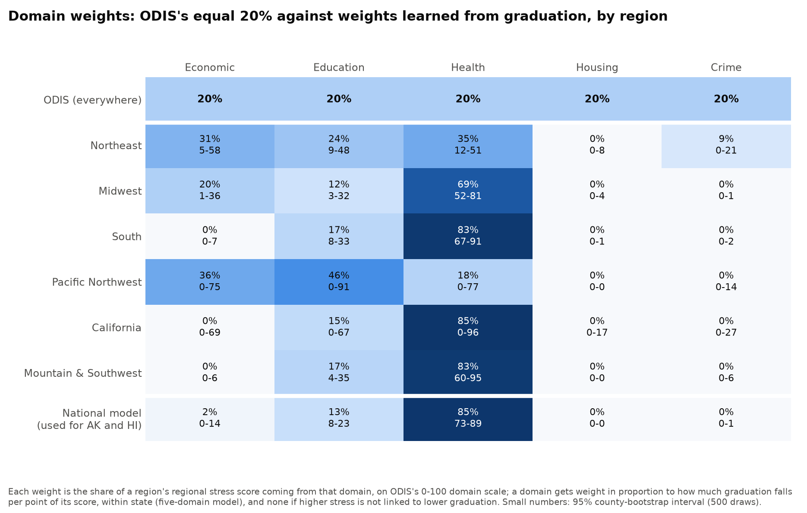

**From slopes to weights.** Each region's weights come from its five-domain slopes.
A domain gets weight in proportion to how many points of graduation are lost per point of its 0-100 score (its slope divided by its SD), so the weights apply to the same 0-100 domain scores ODIS averages.
A domain whose stress is not linked to lower graduation (a slope of zero or above) gets no weight, since a stress score should not reward stress.
The weights are normalized to sum to 100%, and a school missing a domain gets the average of the domains it has, re-weighted, just as ODIS does.
The 95% intervals come from 500 county-cluster bootstrap draws within each region ([`domain_weights.csv`](05-regional-weights/domain_weights.csv), including how often each weight is exactly zero).

Two things stand out:

- **Health carries most of the weight in the South (83%), the Mountain & Southwest (83%), California (85%), and the Midwest (69%)**, and 85% in the national model; the Northeast spreads it across Health (35%), Economic (31%), and Education (24%).
  The Pacific Northwest's weights are too uncertain to read: its Economic, Education, and Health intervals each span 0 to more than 75%.
- **Housing and, outside the Northeast, Crime get no weight.**
  That matters because of how the ODIS composite is built: equal weights on the 0-100 scale are not equal influence.
  `Crime` has by far the widest spread (SD 22.8, against 7.1 for `Economic` and `Health`), so it accounts for **45%** of the variation in the composite among schools with all five domains ([`composite_variance_shares.csv`](05-regional-weights/composite_variance_shares.csv)), while `Health` accounts for 12%.

### ODIS composite against the regional score

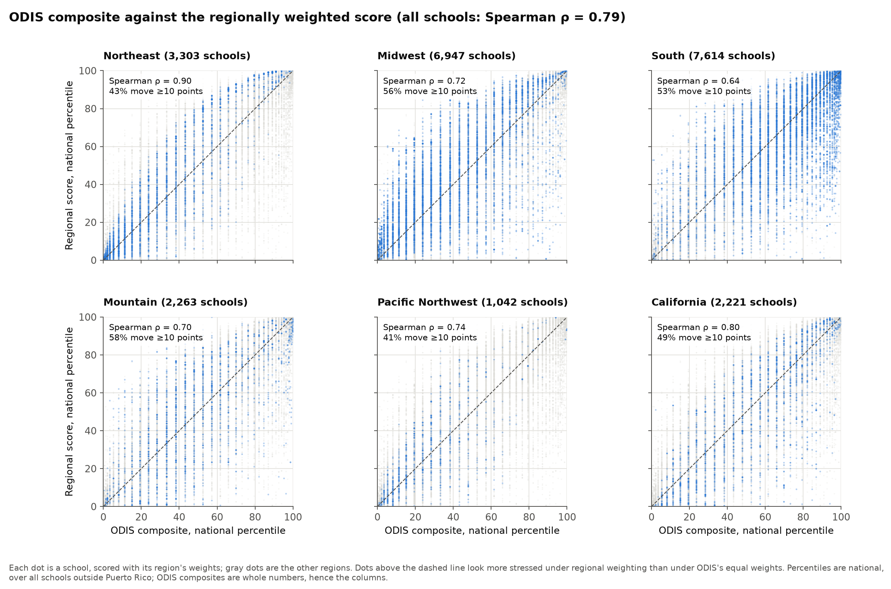

The regional score ranks schools similarly to the ODIS composite overall (Spearman ρ = 0.79), but individual schools move a lot:

| Region | Schools | Spearman ρ | Mean absolute rank change | Schools moving 10+ percentile points |
| --- | ---: | ---: | ---: | ---: |
| Northeast | 3,303 | 0.90 | 10.5 | 43% |
| Midwest | 6,947 | 0.72 | 14.9 | 56% |
| South | 7,614 | 0.64 | 14.7 | 53% |
| Pacific Northwest | 1,138 | 0.75 | 12.2 | 46% |
| California | 2,221 | 0.80 | 13.5 | 50% |
| Mountain & Southwest | 2,048 | 0.70 | 15.7 | 57% |
| Alaska (national weights) | 76 | 0.80 | 26.1 | 85% |
| Hawaii (national weights) | 43 | 0.41 | 19.5 | 74% |
| All scored schools | 23,390 | 0.79 | 14.1 | 52% |

Percentiles are national, over all schools outside Puerto Rico, and rank change is the regional percentile minus the ODIS percentile.


- **Who moves down:** schools that ODIS ranks as highly stressed mainly because of `Crime` or `Housing`.
  Examples are the northern Wisconsin lake counties, where vacation homes drive the housing vacancy indicator to its maximum: Oneida County's schools average the 92nd percentile under ODIS and the 14th under the regional score.
  Among counties with at least five schools, eight move down by 60 to 79 points, three of them in northern Wisconsin.
- **Who moves up:** schools with high `Health` stress but little crime or housing stress, often suburban and exurban, such as Utah County, Utah (+36 points on average over 28 schools) and Ramsey County, Minnesota (+34 over 90 schools).

[`regional_stress_score.csv`](../data/derived/regional_stress_score.csv) in `data/derived/` has every school's scores, percentiles, and rank change; [`county_rank_change.csv`](05-regional-weights/county_rank_change.csv) the county means; [`top_movers.csv`](05-regional-weights/top_movers.csv) the 15 schools moving most each way; and [`rank_change_by_region.csv`](05-regional-weights/rank_change_by_region.csv) the table above.

### Does the regional score predict graduation better?

It is fit to graduation, so in-sample it must; the fair test is out of sample.
Counties are split into five folds; the weights are refit without each fold's counties and used to score that fold's schools ([`cross_validation.csv`](05-regional-weights/cross_validation.csv)).
Within state, the held-out regional score correlates with graduation at r = -0.21, against -0.15 for the ODIS composite.
The gain is largest in the Mountain & Southwest (-0.25 against -0.09) and the South (-0.21 against -0.12), and small in the Northeast (-0.30 against -0.28), the Pacific Northwest (-0.08 against -0.05), and California (-0.08 against -0.07).
Either way, community conditions explain only a small part of the differences in graduation between schools in the same state: the within-state R² is 0.01 to 0.10.

### Sensitivity

[`sensitivity.csv`](05-regional-weights/sensitivity.csv) refits the five-domain model three other ways: precise rates only (ranges of at most 5 points, cohorts of 61 or more), no state fixed effects, and all non-suppressed rates including the 50-point bins.
The main patterns hold in all three: the Health slope stays strongly negative in the Midwest, South, and Mountain & Southwest (-3.3 to -7.4 points per SD), Housing stays positive in the Mountain & Southwest (+2.7 to +3.2), and Crime is never significantly negative.
The Pacific Northwest slopes are the least stable; its Economic slope ranges from -1.7 to +1.1.

### Caveats

- **Correlation, not causation.** A slope says how graduation differs between schools whose communities differ on a domain, within a state; it does not say that changing the domain would change graduation.
- **Graduation is one outcome.** Weights learned from it say nothing about health, safety, or well-being outcomes the ODIS domains may matter for; a different outcome could give different weights.
- **Suppression bias.** Small schools, and most alternative, career-technical, and special education schools, have no usable rate, so the models describe regular high schools with cohorts of 16 or more best.
  Range midpoints add noise, most for cohorts of 16-60.
- **ODIS measures communities, not students.** The domains describe the neighborhood around a school (its attendance area, or its ZIP code), not the students enrolled; for magnet, charter, and virtual schools the two can differ a lot.
- **Domain names are not mechanisms.** `Health` includes SNAP participation and children's health insurance as well as birth outcomes and lead risk, so part of its weight is family poverty; `Housing` is vacancy, affordability, and park access, not homelessness, which it does not measure.
- **Graduation rates are set by states.** State fixed effects handle differences in how states define and certify graduation, but also mean that differences between states are not used at all; California, a single state, is compared only within itself.
- **Small regions.** The Pacific Northwest (761 schools in the five-domain model) has very uncertain weights; Alaska and Hawaii borrow the national weights, and Puerto Rico is not scored.
  The Northeast's five-domain model excludes Connecticut, which has no `Crime` score.

### Findings

1. **One formula does not fit everywhere.** How much the ODIS domains predict graduation differs significantly across regions (joint Wald χ² = 172 on 25 df, p < 0.0001), driven by Health, Housing, and Economic stress.
2. **Health is the domain that tracks graduation.** Within states, one SD more `Health` stress goes with 3.4 to 7.4 points lower graduation in the Midwest, South, and Mountain & Southwest, 2.6 to 5.6 times as much as in the Northeast (1.3 points), with confidence intervals that exclude equality.
3. **The composite's biggest driver predicts graduation least.** `Crime` accounts for 45% of the variation in the equal-weight composite but is not significantly linked to graduation in any region, and more `Housing` stress never goes with lower graduation (in the Mountain & Southwest it goes with 3.2 points *higher*).
4. **Regional weighting reshuffles half the schools.** Scored with its region's weights, 52% of schools move 10 or more national percentile points (Spearman ρ = 0.79 with the ODIS composite), most in the Mountain & Southwest (57%) and least in the Northeast (43%).
5. **It predicts graduation modestly better out of sample**, r = -0.21 against -0.15 within state for held-out counties, mostly in the Mountain & Southwest and the South; neither score explains much of the variation in graduation within a state (R² at most 0.10).
